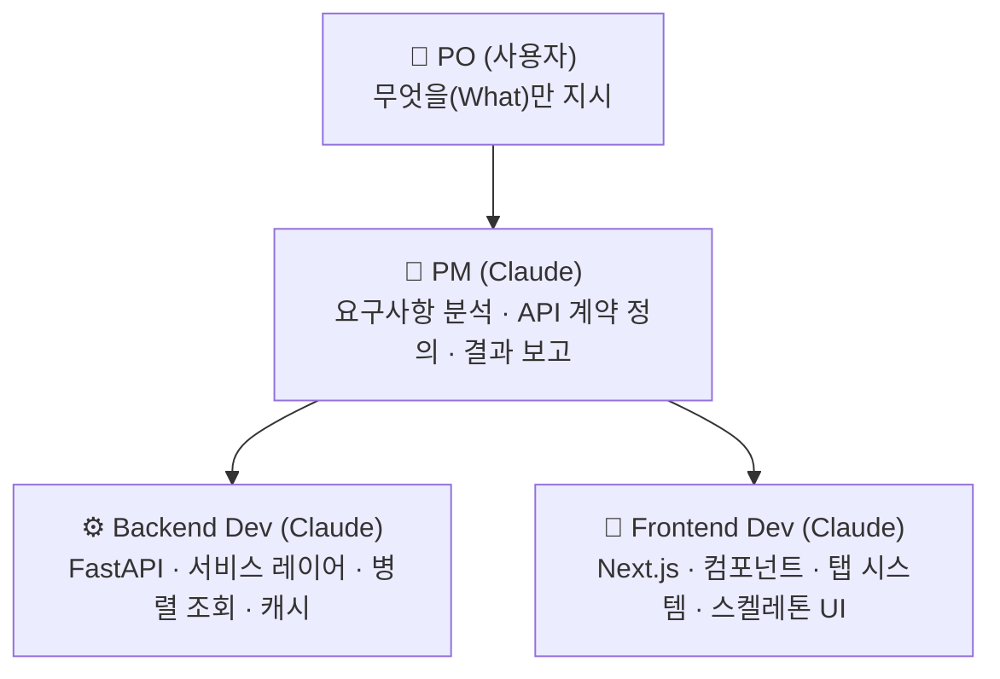
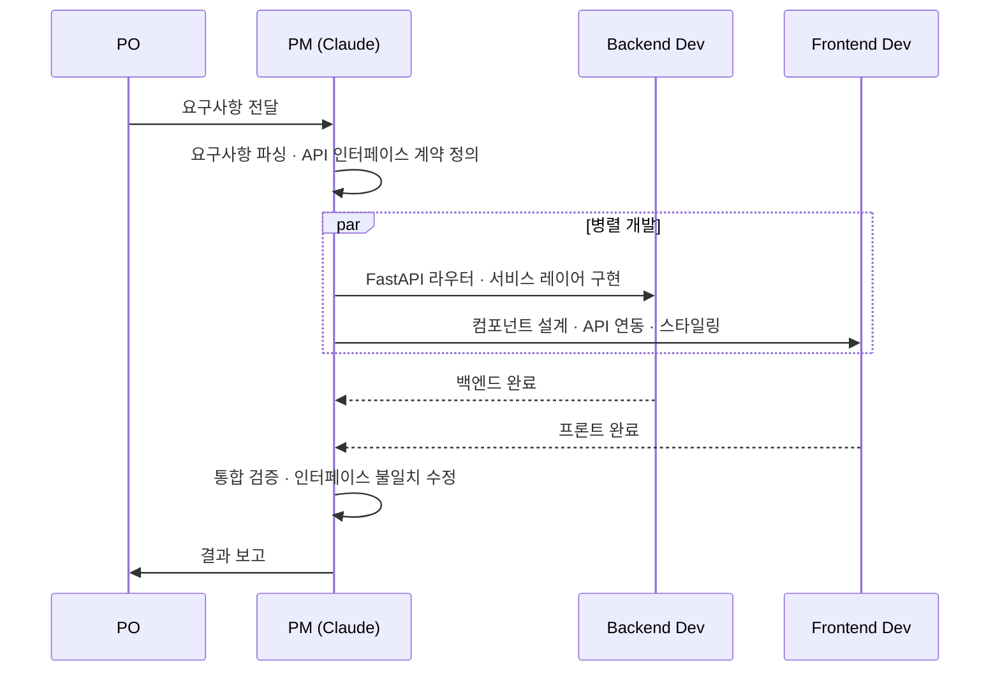
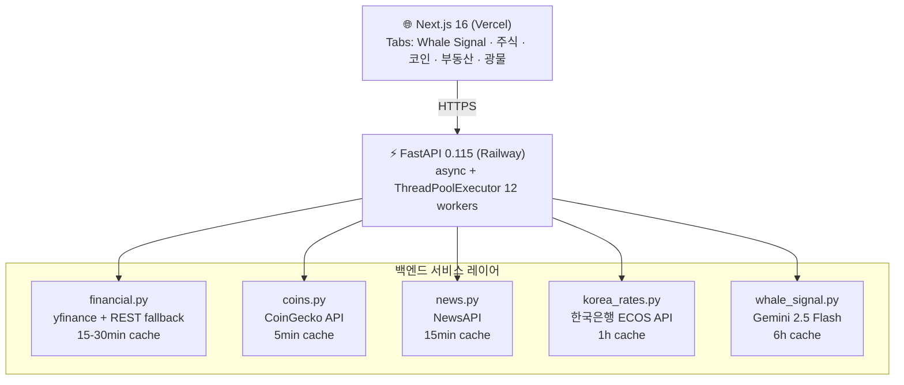
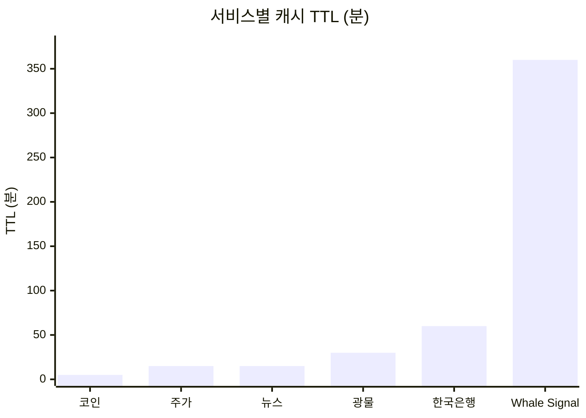
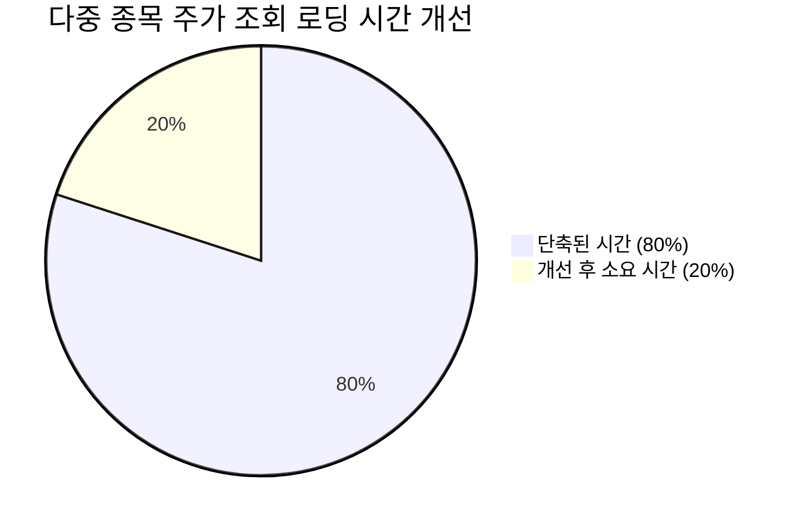

# Whalyx

> **Whale Tracker** — 거대한 돈이 어디로 이동하는가를 실시간으로 추적하는 투자 인텔리전스 플랫폼

[](https://www.python.org/)
[](https://nextjs.org/)
[](https://fastapi.tiangolo.com/)
[](https://ai.google.dev/)
[](https://railway.app/)
[](https://vercel.com/)

**Live Demo**
- 🐋 Frontend: https://whalyx.vercel.app
- ⚡ Backend API: https://shimmering-smile-production-afa2.up.railway.app/docs

---

## STAR — 이 프로젝트를 왜 만들었나

### S (Situation)
금리가 오르면 채권이 유리하고, 코인이 흥하면 BTC를 사야 한다 — 이 판단을 하려면 Fed 금리·주식·코인·부동산·광물 데이터를 여러 사이트에서 수작업으로 모아야 했다. 일반 투자자가 "지금 내 돈을 어디에 넣어야 하는가"를 한눈에 파악할 수 있는 통합 플랫폼이 없었다.

### T (Task)
Claude PM / Backend Dev / Frontend Dev **3-Agent 오케스트레이션**을 직접 설계·조율하며 PM 역할 수행. 백엔드(FastAPI 서비스 레이어)·프론트(Next.js 탭 시스템) 전 과정 개발 담당.

### A (Action)
- PM-Backend-Frontend 에이전트 간 **API 인터페이스 계약 선행 설계** 후 병렬 개발
- SEC 13F 기반 **8인 전문 투자자** 포트폴리오 큐레이션 (Buffett·Wood·Burry·Dalio·Druckenmiller·Ackman·Soros·Tepper)
- `ThreadPoolExecutor` 12개 병렬 주가 조회 + 인메모리 캐시 → Yahoo Finance 429 우회
- **Whale Signal**: 금리 환경 + 30일 수익률 기반 5단계 투자 신호 (SB/BUY/Neutral/AVD/SS)
- **한국은행 ECOS API** 연동 — 기준금리·국고채·CD금리·원달러 환율 실시간 표시
- 주식·코인·부동산·광물·Whale Signal **5탭** + Gemini AI 거시경제 분석

### R (Result)
- 초기 로딩 시간 **80% 단축** (순차 → 12병렬 ThreadPoolExecutor)
- 복수 투자자 매수 추천 **5개 종목** 실시간 제공 (NVDA·META·MSFT·GOOGL·AMZN)
- 운영 비용 **$0/month** (Gemini 무료 티어 + CoinGecko 무료 API + yfinance + BOK 무료)
- Claude 에이전트 오케스트레이션으로 **단일 세션** 내 기획~배포 완성

---

## 개발 방식 — Claude AI 에이전트 오케스트레이션

이 프로젝트는 **Claude Code 3-Agent 오케스트레이션**으로 개발되었다.



**에이전트 협업 원칙**
- PO는 *무엇을(What)* 만 지시. *어떻게(How)* 는 PM과 팀이 결정
- Backend Dev / Frontend Dev가 공통 인터페이스 계약(API 스펙)을 기준으로 병렬 개발
- PM이 통합 시 불일치를 감지하고 즉시 수정 지시

**병렬 개발 워크플로우**



| 항목 | 오케스트레이션 적용 결과 |
|------|------------------------|
| 개발 속도 | 기획 → 백엔드 → 프론트 → 배포까지 단일 세션 내 완성 |
| 아키텍처 일관성 | 컨텍스트 유실 없이 전체 스택 일관된 설계 유지 |
| 인터페이스 충돌 | API 계약 선행 정의로 백엔드·프론트 충돌 0건 |

---

## Features

### 🐋 Whale Signal 탭 (메인)
| 기능 | 설명 |
|------|------|
| 5단계 투자 신호 | **SB**(Strong Buy) / **BUY** / **Neutral** / **AVD**(Avoid) / **SS**(Super Sell) |
| 자산군 클릭 이동 | 카드 클릭 시 해당 탭으로 즉시 이동 (주식·코인·부동산·광물) |
| Gemini AI 분석 | 거시경제 상황 기반 "거대한 돈이 어디로 이동하는가" 실시간 인사이트 |
| SS 매도 경고 | Super Sell 자산: 보유 중인 종목 매도 검토 목록 표시 |

### 📊 주식 탭
| 기능 | 설명 |
|------|------|
| 전문 투자자 포트폴리오 | 8인 (Buffett·Wood·Burry·Dalio·Druckenmiller·Ackman·Soros·Tepper) SEC 13F 기준 |
| 매수 추천 신호 | 복수 투자자가 동시 매수 중인 종목 자동 집계 |
| 매도 주의 신호 | 복수 투자자 동시 매도 종목 경보 |
| 고래 핫 종목 | 포트폴리오 중복 보유 빈도 기반 TOP 12 |
| 종목 상세 | 1일/7일/30일 가격 차트 (Recharts) + AI 인사이트 (Gemini) + 최신 뉴스 |

### ₿ 코인 탭
- CoinGecko 실시간 시세 (BTC·ETH·SOL·BNB 외 10종)
- 24h·7d·30d 변동률 + 7일 스파크라인 차트
- 암호화폐 최신 뉴스

### 🏠 부동산 탭
- 서울 아파트 매매가격지수·전세가율·거래량 등 주요 지표 6개
- 한국어 부동산 최신 뉴스

### ⛏️ 광물 탭
- 8종 광물/원자재 실시간 시세 (금·은·구리·원유·우라늄·리튬·플래티넘·천연가스)
- 카테고리별 분류 (귀금속·산업금속·에너지·배터리)
- 30일 미니 차트 + 광물 관련 뉴스

### 💰 돈의 흐름 (Whale Signal 탭 하단)
- 금리·SPY·TLT·GLD·BTC 30일 성과 한눈에 비교
- Fed 기준금리 레벨별 자동 투자 신호
- **한국은행 ECOS API** — 기준금리·국고채 3년/10년·CD금리·원달러 환율 실시간

---

## Architecture



---

## Caching Strategy



| 서비스 | TTL | 이유 |
|--------|-----|------|
| 주가 (yfinance) | 15분 | Yahoo Finance 429 방어 |
| 코인 (CoinGecko) | 5분 | 실시간 시세 중요도 높음 |
| 광물 (yfinance) | 30분 | 장중 변동 적음 |
| 뉴스 (NewsAPI) | 15분 | 무료 티어 100 req/day 절약 |
| Whale Signal | 6시간 | Gemini API 비용 최소화 (분당 limit 우회) |
| 한국은행 금리 | 1시간 | 금리·환율은 일 1회 업데이트 |

> 캐시는 모두 **인메모리(dict)**. Railway 재시작 시 초기화되며, 콜드 스타트 후 첫 요청에서 외부 API 호출.

---

## Tech Stack

| 영역 | 기술 | 선택 이유 |
|------|------|-----------|
| Backend | FastAPI + Python 3.11 | async 지원, 자동 OpenAPI 문서 |
| Frontend | Next.js 16 + TypeScript | App Router, 정적 최적화 |
| AI | Gemini 2.5 Flash | 무료 티어, 긴 컨텍스트 |
| 주가 | yfinance + Yahoo Finance REST | 무료, REST 폴백으로 IP 차단 우회 |
| 코인 | CoinGecko API v3 | 무료, sparkline 지원 |
| 뉴스 | NewsAPI | 다국어 지원, URL 기준 중복 제거 |
| 한국 금리 | 한국은행 ECOS API | 기준금리·국고채·CD금리·원달러 환율 |
| 차트 | Recharts | React 네이티브, 커스텀 가능 |
| 배포 | Railway (BE) + Vercel (FE) | 무료 티어 프로덕션 지원 |

---

## API Endpoints

```
GET /                        # 헬스체크
GET /investors               # 전체 투자자 목록 + 주가
GET /investors/{id}          # 투자자 상세 + 포트폴리오 + AI 인사이트
GET /stocks/hot              # 핫 종목 TOP 12
GET /stocks/recommendations  # 매수/매도 추천 신호
GET /stocks/{ticker}?period= # 종목 상세 + 차트 (1d/7d/30d) + AI 분석
GET /crypto                  # 코인 시장 + 뉴스
GET /crypto/{coin_id}        # 개별 코인 상세
GET /realestate              # 한국 부동산 지표 + 뉴스
GET /commodities             # 광물/원자재 시세 + 뉴스
GET /money-flow              # 자산군별 수익률 + 금리 신호 + 한국 금리
GET /whale-signal            # 5단계 투자 신호 + Gemini AI 거시경제 분석
GET /korea-rates             # 한국은행 기준금리·국고채·CD금리·원달러 환율
```

---

## Performance



| 항목 | 개선 전 | 개선 후 |
|------|---------|---------|
| 다중 종목 주가 조회 | 순차 (0.5s × N개) | 12개 병렬 (ThreadPoolExecutor) |
| 반복 요청 | 매번 외부 API 호출 | 서비스별 TTL 인메모리 캐시 |
| 체감 로딩 | 흰 화면 대기 | 스켈레톤 UI (shimmer) |
| 뉴스 중복 | 동일 기사 반복 노출 | URL + 제목 40자 기준 중복 제거 |

---

## Local Setup

```bash
# 환경 변수 설정
cp backend/.env.example backend/.env
# GEMINI_API_KEY, NEWS_API_KEY, BOK_API_KEY 입력

# 백엔드 실행
pip install -r backend/requirements.txt
python -m uvicorn backend.api.main:app --reload --port 8000

# 프론트엔드 실행
cd frontend
npm install
NEXT_PUBLIC_API_URL=http://localhost:8000 npm run dev
```

---

## Investors (SEC 13F 기준)

| 투자자 | 소속 | 스타일 | 대표 보유 |
|--------|------|--------|-----------|
| Warren Buffett | Berkshire Hathaway | 가치투자 | AAPL · AXP · KO |
| Cathie Wood | ARK Invest | 혁신성장 | TSLA · COIN · PLTR |
| Michael Burry | Scion Asset Mgmt | 역발상 | BABA · JD · BIDU |
| Ray Dalio | Bridgewater Associates | 매크로·분산 | SPY · EEM · GLD |
| Stanley Druckenmiller | Duquesne Family Office | 기술주·매크로 | NVDA · MSFT · META |
| Bill Ackman | Pershing Square | 행동주의 | HLT · QSR · CMG |
| George Soros | Soros Fund Mgmt | 글로벌 매크로 | NVDA · META · AMZN |
| David Tepper | Appaloosa Management | 이벤트 드리븐 | META · MSFT · NVDA |
