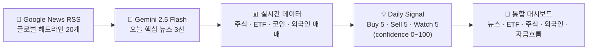
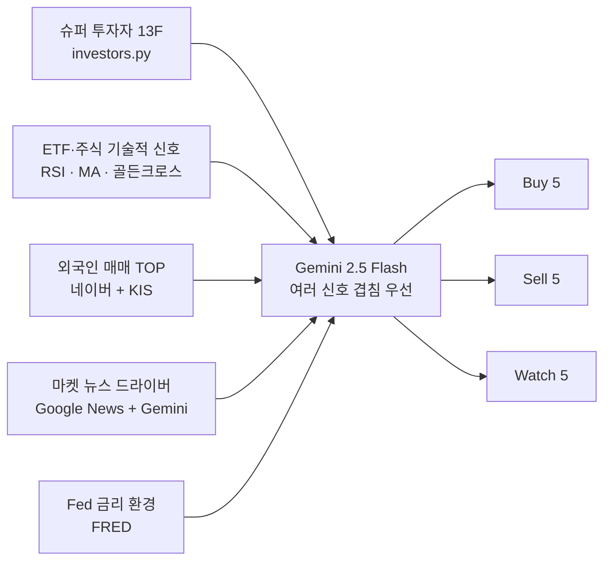
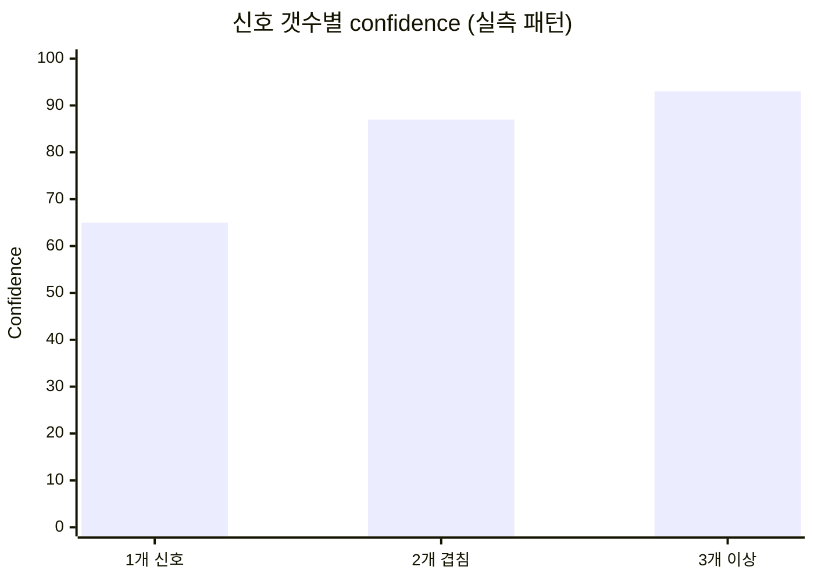
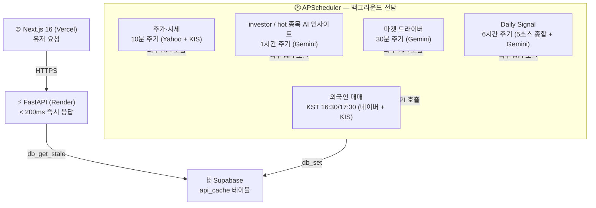
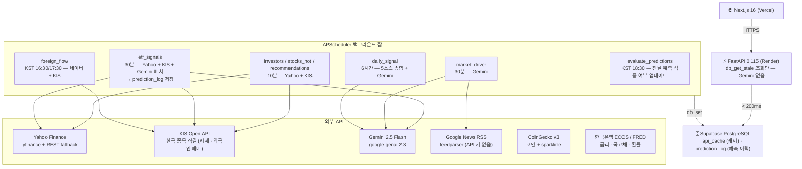
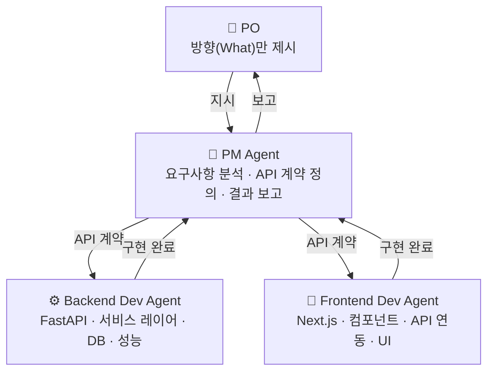
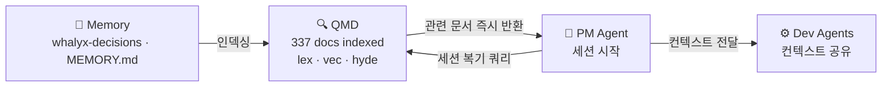

# Whalyx

[](https://www.python.org/)
[](https://nextjs.org/)
[](https://fastapi.tiangolo.com/)
[](https://ai.google.dev/)
[](https://render.com/)
[](https://vercel.com/)

🐋 [whalyx.vercel.app](https://whalyx.vercel.app) · ⚡ [API Docs](https://whalyx.onrender.com/docs)

---

뉴스 하나가 시장을 바꾼다. 이란-미국 협상, Fed 발언, 반도체 규제 — 이런 변수들이 터지는 순간, 어떤 자산이 오르고 어떤 자산이 내려갈지 빠르게 판단해야 한다. 그런데 뉴스, 주식, 코인, 부동산, 자금흐름을 한곳에서 볼 수 있는 곳은 없었다.

AI가 오늘의 핵심 뉴스를 골라주고, 그에 따른 자산 변화를 한 화면에서 볼 수 있다면 투자 판단이 달라질 수 있다고 생각했다. 그래서 만들었다.

---

## 버전 히스토리

| 버전 | 날짜 | 내용 |
|------|------|------|
| v3.4 | 2026-05-26 | **My Lab — 실시간 포트폴리오 대시보드 신규**. `backend/services/mylab.py` 신규(GitHub API로 private repo `forexms78/stock78` 연동, 서버사이드 `MYLAB_PASSWORD` 인증, 경로 순회 방지). **포트폴리오 파서**: `portfolio.md`(평단가+수량 포맷)를 파싱하여 구조화 JSON 변환, `financial.py`의 `get_stock_data()`로 21종목 현재가 실시간 fetch — 한국 종목 `.KS` 접미사 자동 변환, 해외 종목은 USD 가격 x `money_flow` 캐시 환율(KRW/USD)로 원화 환산, 손익/수익률 자동 계산(10분 메모리 캐시). API 5개: `POST /mylab/auth`(인증), `GET /mylab/portfolio`(실시간 대시보드), `GET /mylab/analyses`(분석 파일 목록), `GET /mylab/analyses/{filename}`(파일 내용). 프론트 `MyLabSection.tsx` — 잠금 게이트(localStorage 상태 유지), KPI 카드 3종(총 평가금·총 손익·종목 수), 자산배분 바(국내 주식·국내 ETF·해외 개별주·해외 ETF 색상 구분), 카테고리 탭 필터, 종목 테이블(수익률 녹/적 색상 코딩, live/offline 표시), 환율 헤더. `GITHUB_TOKEN`(stock78 읽기 PAT)·`MYLAB_PASSWORD` 환경변수 필요 |
| v3.3 | 2026-05-23 | **AI 추천 회고·자기학습 루프 신규** — 비대칭 학습 구조(맞은 추천은 통계만, 빗나간 추천만 Gemini 심층 분석). Supabase 마이그레이션 `backend/migrations/0001_review_tracking.sql` 신규 — `prediction_snapshots`(추천 시점 진입가·모멘텀·감성·거래량·raw_score·AI 이유 + 1d/7d/30d 검증 결과 컬럼), `failure_analyses`(snapshot_id FK, horizon, failure_category, root_cause, avoid_rule, severity 1~5), `v_weekly_hit_rate` 뷰. `backend/services/prediction_tracker.py` 신규 — `save_snapshot`/`verify_past_predictions`(만기 도래 1d/7d/30d hit 판정, 적중기준은 buy ret>0 · sell ret<0 · watch \|ret\|≥1%)/`analyze_failures`(빗나간 케이스만 Gemini로 카테고리·원인·회피규칙 생성, horizon당 최대 10건 cap)/`get_active_failure_patterns`(최근 30일 빈도×severity Top 3 + 회피 규칙). `today_picks.py` 수정 — `_gemini_reason`에 `lesson_block` 파라미터 추가, `_build_card`에 raw_score·final_score·matched_patterns 필드 추가, raw_score × 0.7^N 페널티(매칭된 회피 패턴 수), 결과 저장 직후 `save_snapshot` 호출. `scheduler.py`에 `refresh_review_cycle` 잡 추가 — 매일 KST 07:00(UTC 22:00) verify + analyze 순차 실행. API 신규 5개 — `/review/summary`(통산 적중률·평균수익률·이번주 vs 지난주 변화량), `/review/snapshots?limit=60`(추천 이력), `/review/failures?limit=15`(실패 분석 + snapshot JOIN), `/review/lessons`(Top 3 + 전체 활성 규칙), `/review/weekly-trend`(주간 추이 26주). 프론트 `app/review/page.tsx` 신규 — KPI 4종, 이번주 vs 지난주 변화량 카드, recharts 주간 적중률 라인차트(1d/7d/30d 3선), 빗나간 픽 카드 + AI 학습 로그 타임라인 2:1 그리드, 적용 중 회피 규칙 Top 3 박스, 맞춘 추천 간단 리스트. 진입점은 직접 URL `/review` (dashboard 헤더 링크 추가는 후속 sprint) |
| v3.2 | 2026-05-22 | **ETF 예측 이력 저장 및 정확도 평가 시스템 추가.** `backend/services/prediction_logger.py` 신규 — ETF 신호 생성 시 `prediction_log` 테이블에 ticker·signal·RSI·trend_phase·price_at_signal upsert 저장, 매일 KST 18:30 전날 예측에 실제 종가·변동률·적중 여부(correct_1d) 자동 업데이트, `get_accuracy_stats(days)` 로 신호별/기간별 적중률 통계 조회. `scheduler.py`: `refresh_etf_signals` 완료 후 `save_etf_predictions()` 호출 추가, `evaluate_predictions` 잡 신규(UTC 09:30 = KST 18:30 장 마감 1시간 후). Supabase `prediction_log` 테이블 신규(signal_date + ticker UNIQUE 제약, signal_date 인덱스). 누적 30일 이후 신호별 적중률 통계로 RSI 임계치·추세별 시그널 로직 튜닝 기반 마련 |
| v3.1 | 2026-05-20 | **README 본문 최신화** — 구 Quant 트레이딩 섹션 통째 제거(퀀트·자동매매 기능 제거 반영), "준비 중" KIS US 자동매매 섹션 제거(전체 매매 비활성화), "어떤 정보를 보여주는가" Whale Signal → Daily Signal로 갱신(5소스 + Gemini 종합), "만들면서 부딪힌 문제들"의 FinBERT 잡 표기 제거, 시스템 구조 다이어그램·엔드포인트 목록·기술 스택을 v3.0 코드 기준으로 재작성(KIS·foreign_flow·daily_signal·admin 라우트 명시, google-genai 2.3·httpx 0.28·supabase 2.30·pydantic 2.13 버전 반영). 버전 히스토리는 그대로 보존 |
| v3.0 | 2026-05-20 | **데일리 시그널 + 추천 알고리즘 문서화 + KIS 직결 + SDK 업그레이드.** WhaleSignal → DailySignal 전환(슈퍼 투자자·ETF·외국인·뉴스 5가지 신호를 Gemini가 종합), 퀀트 자동매매 전면 제거(매매 함수 4개에 `TRADING_DISABLED` 가드, 관련 백엔드 서비스 모듈 8개 + 프론트 페이지·컴포넌트 11개 삭제 — 6,000줄 정리). KIS Open API 한국 종목(`.KS`/`.KQ`) 직결 — `financial.py` 일봉(30d/3mo) + `etf_signals.py` 1년 일봉(`inquire-daily-itemchartprice` 100건 페이징)로 Yahoo 대비 신선도 ~20분 향상(`yahoo_lag_sec` 1,201초 실측). `google-genai` 1.2 → 2.3 업그레이드(thinking_budget=0으로 응답 잘림 차단, response_mime_type=application/json 강제, timeout 60s, httpx/supabase/pydantic 의존성 도미노 동반 갱신). DailySignalSection UX 개선 — 카드 5→3 미리보기·클릭 시 StockModal·각 컬럼 하단 "+N개 더 보기 → ETF·주식 탭" 점선 버튼. README에 추천 알고리즘 + 슈퍼 투자자 8인 검증 + 신호별 가중치 섹션 추가. `/debug/kis-vs-yahoo` 신선도 비교 엔드포인트, `/admin/refresh-daily-signal` 캐시 즉시 갱신 엔드포인트 추가 |
| v2.27 | 2026-05-16 | 외국인 매매 v3 — **전용 탭 분리 + 과거 날짜 조회**. 네이버 iframe·integration API 모두 `bizdate` 파라미터를 무시(항상 당일 데이터)로 확인됨 → 과거 데이터는 매일 누적이 유일한 방법. scheduler `refresh_foreign_flow`에 `top_history`(종목 TOP) 누적 머지 로직 추가(15일 cap, 페이로드 절약 위해 ticker/name/value/volume 4필드로 슬림). 응답 스키마 확장: `top_history`, `available_dates`(최신순), `current_date`. dashboard `Tab` 타입에 `"foreign"` 추가, 기존 signal 탭의 ForeignFlowSection 분리해 전용 탭으로 이동, i18n `tab.foreign`(KO "외국인 매매" / EN "Foreign Flow") 사전 추가. `ForeignFlowSection` UI 전면 개편: KOSPI/KOSDAQ pill + 날짜 드롭다운(전체 누적일, 한국어 요일 포맷) + 이전일/다음일 버튼, 시장 합계 카드에 "기준일 YYYY년 M월 D일 (요일)" 명시, 데이터 없는 날짜는 dashed 박스로 "누적되지 않음" 안내, `top_history`/`market_history` 선택 날짜 매칭하여 클라이언트 사이드 렌더링 |
| v2.26 | 2026-05-16 | 외국인 매매 v2 — **시장 합계 데이터 추가**: 네이버 모바일 `/api/index/{KOSPI\|KOSDAQ}/integration` `dealTrendInfo` 발굴(외국인·기관·개인 당일 순매수 합계, 단위 백만원). `foreign_flow.py` `get_market_deal_trend_today()` 신규. `scheduler.py` `refresh_foreign_flow`에 history 누적 머지 로직 추가 — 매일 같은 bizdate면 update, 다른 bizdate면 append, 최근 30일 cap. 응답 스키마 확장: `market_today` + `market_history` 필드 추가. **프론트 UI 신규**: `components/ForeignFlowSection.tsx` — KOSPI/KOSDAQ pill 토글, 시장 합계 3개 카드(외국인·기관·개인 색상 코딩), 외국인 순매수/순매도 TOP 10 좌우 그리드, 모바일 1열 반응형. 단위 환산 유틸 `fmtMil`: 1조 이상 "조", 1억 이상 "억", 그 이하 "백만". `dashboard/page.tsx` signal 탭에 dynamic import로 끼워넣음(코드 스플리팅 유지). 한국 종목 모달은 yfinance가 `.KS`/`.KQ` 접미사를 요구하므로 이번 sprint에선 클릭 비활성 |
| v2.25 | 2026-05-15 | 외국인 매매 데이터 신규 — `backend/services/foreign_flow.py` 신규(네이버 금융 iframe 스크래핑 + 한투 KIS Open API 결합), `GET /foreign-flow`(KOSPI/KOSDAQ 외국인 순매수·순매도 종목 TOP 20, 네이버 데이터 기반, DB-Only)와 `GET /foreign-flow/{ticker}`(종목별 외국인·기관·개인 일별 매매 추이, KIS `inquire-investor` TR_ID `FHKST01010900`, 5분 캐시) 두 엔드포인트 추가. 스케줄러는 KST 16:30 + 17:30(UTC 07:30 / 08:30) 두 차례 `refresh_foreign_flow`로 Supabase `api_cache.foreign_flow`에 적재 — 화면은 캐시 read-only. **시도·교체 이력**: 1차 PyKRX로 작성했으나 KRX가 anonymous 호출 차단(`KRX 로그인 실패`)으로 빈 응답 → 2차 네이버 금융 페이지 시도 시 본 페이지가 빈 껍데기여서 `sise_deal_rank_iframe.naver?sosok={01\|02}&investor_gubun=9000&type={buy\|sell}` iframe URL 직접 호출로 정착. requirements `pykrx` 제거 + `beautifulsoup4>=4.12.0` 명시 추가 |
| v2.24 | 2026-05-09 | Render cold start 방지 — `.github/workflows/keep-alive.yml` 신규. GitHub Actions cron이 10분마다 `https://whalyx.onrender.com/` health endpoint에 curl ping (`*/10 * * * *`, 최대 90초 대기). Render 무료 플랜의 15분 idle sleep 직전에 호출해 깨움 → 첫 진입자 30~60초 cold start 대기 시간 제거. 비용 0 (public repo Actions 무제한), `workflow_dispatch`로 수동 실행도 가능 |
| v2.23 | 2026-05-09 | 로딩 속도 2차 최적화 — **(1) 코드 스플리팅**: dashboard에서 `InvestorModal`·`StockModal`·`QuantTab` `dynamic()` import(클릭 시점에만 chunk 로드), `MarketsSection` 안 `CryptoSection`·`RealEstateSection`·`CommoditySection`·`BondsSection` 동일하게 dynamic 처리 → 초기 번들에서 마켓 서브·모달·퀀트 코드 제외. **(2) Service Worker stale-while-revalidate**: `public/sw.js` 신규(정적 자원 cache-first, Whalyx API stale-while-revalidate, 캐시 즉시 표시 + 백그라운드 갱신), `components/ServiceWorkerRegister.tsx` `app/layout.tsx`에서 production 빌드에만 등록 → 두 번째 방문 시 즉시 표시. **(3) 이미지 lazy loading**: `WhaleSignalSection`·`CryptoSection`·`NewsCard` 모든 ``에 `loading="lazy"` + `decoding="async"` 추가 → 뷰포트 밖 이미지 지연 로드, 메인 스레드 블로킹 감소 |
| v2.22 | 2026-05-09 | 로딩 속도 개선 — ETF·주식 시그널 dashboard 초기 `Promise.all`에 추가해 6개 엔드포인트 병렬 prefetch (기존: ETF 탭 클릭 시점에야 fetch → 새로: 첫 진입 시 동시 받아 탭 클릭 즉시 표시). `ETFStockSection`에 `data` prop 추가, 외부 prefetch 받으면 즉시 표시·prop 없을 때만 fallback fetch. `app/layout.tsx`에 `<link rel="preconnect">` 추가(API 도메인 `whalyx.onrender.com` + Pretendard CDN `cdn.jsdelivr.net`) — DNS lookup + TCP + TLS 핸드셰이크 사전 처리로 첫 fetch 200~500ms 단축 |
| v2.21 | 2026-05-08 | Hero 시간 필터 동적 수익률 + ETF 카드 가격 원화 메인 + i18n 2차 확장. **Hero**: 1W/1M/3M/YTD/1Y/ALL 클릭 시 차트뿐 아니라 수익률 숫자도 동기화(`RANGE_MULTIPLIER`로 30일 베이스 × 시간 비율 — 1W 0.22 / 1M 1.0 / 3M 2.4 / YTD 1.8 / 1Y 3.6 / ALL 8.5), label에서 "30일" 제거(시간 범위는 부제로). **ETF 가격**: 메인은 원화 `₩XXX,XXX`, 부가로 작게 `$XXX`. dashboard에서 `usdKrw` prop 전달, `fmtPrice`가 main+sub 반환. **i18n 2차**: dashboard FED 툴팁·자산별·KRW/USD·갱신 텍스트, 마켓 드라이버 강세/약세/혼조 태그, WhaleSignalSection(Fed 기준금리·자산군별 투자 신호·매도 압력·투자 매력도·글로벌/아시아 시장), MoneyFlowSection(돈의 흐름·한국은행 주요 지표·KOR 기준금리·국고채 3y/10y·CD 91D·툴팁·전일 대비·데이터 없음/오류), MarketsSection 서브 탭(주식/코인/부동산/광물/채권). **미적용** (다음 sprint): Crypto·Bonds·RealEstate·Commodity 섹션, StockModal·InvestorModal, 퀀트·자동매매, ETF description·Gemini reason 백엔드 영어 분기 |
| v2.20 | 2026-05-08 | KO/EN 언어 토글 1차 — `lib/i18n.ts` 사전 + `LanguageProvider` Context + `useT()` 훅, 헤더 LIVE 인디케이터 옆 KO/EN pill 토글 추가(localStorage 기억), 핵심 라벨 영어화: 탭(Whale Signal · Markets · ETF · Stocks · Quant), Hero 섹션(label/description/CTA), Pilots(Super Investors), Top Performers, ETFStockSection(그룹 라벨·시그널 배지 STRONG_BUY 등·추세 라벨 Markup/Sideways/Markdown·DANGER 경고). 동적 한국어 텍스트(ETF description·AI reason·뉴스 헤드라인) 영어화는 별도 sprint |
| v2.19 | 2026-05-08 | ABCE 시그널 정확도 보정 — 평균회귀 시그널이 강세장에서 일찍 매도하는 약점 보강. **A 추세 가드**: MA50 30일 기울기 기반 `trend_score`(0~100) + `trend_phase`(MARKUP/SIDEWAYS/MARKDOWN), MARKUP 단계 + SAFE/PARTIAL이면 매도 시그널 한 단계 약화(STRONG_SELL→SELL, SELL→HOLD). **E 안전성 등급**: RSI/52주 위치 기반 `safety`(SAFE/PARTIAL/DANGER), DANGER이면 매수 시그널 한 단계 다운그레이드(STRONG_BUY→BUY). 카드 UI 심플화 — 지표 그리드 6개(RSI·52w·MA50·MA200·1M·3M) → 한 줄 인라인 4개(RSI·52w·MA200↑·추세 화살표), description 박스 제거, 시그널 배지 pill 형태로 변경, leftBorder 3px 제거(테두리 hover만), DANGER 종목은 `DANGER · 과열 구간 신규 진입 주의` 라벨 추가 |
| v2.18.1 | 2026-05-08 | admin 엔드포인트 인증 옵셔널화 — `ADMIN_TOKEN` ENV 미설정 시에도 동작(60초 쿨다운만 적용), 설정 시에만 `X-Admin-Token` 헤더 검증. 추가 ENV 작업 없이 즉시 `POST /admin/refresh-etf-signals` 호출 가능 |
| v2.18 | 2026-05-08 | Autopilot 풍 라이트 리모델링 — `HeroSection`(Whalyx Top 8 평균 30일 수익률 헤드라인 + 그린 그라데이션 SVG 차트 + 시간 필터 1W~ALL + 검은 pill CTA), `PilotsSection`(슈퍼투자자 8인 원형 프로필 카드), `TopPerformersSection`(13F 보유 30일 수익률 상위) signal 탭 추가, 라이트 모드 토큰 재정의(흰 #FFFFFF + 그린 강조 #10B981 + 미세 보더), 헤더 단순화(원형 로고 + 그린 펄스 LIVE 인디케이터, 부제 제거), ETF_LIST 매핑 미스매치 4종 정확한 KRX 코드로 교체 — 486290 TIGER 미국나스닥100타겟데일리커버드콜·493810 TIGER 미국AI빅테크10타겟데일리커버드콜·472150 TIGER 배당커버드콜액티브·498410 KODEX 금융고배당TOP10타겟위클리커버드콜, POST `/admin/refresh-etf-signals` 즉시 갱신 엔드포인트(`X-Admin-Token` 헤더 필수, `ADMIN_TOKEN` ENV 미설정 시 503) |
| v2.17 | 2026-05-08 | ETF 풀 7종 확장 — SCHD(미국 배당 성장 대표), TIGER 미국배당다우존스(458730.KS, SCHD 한국 추종), TIGER 미국나스닥100커버드콜(441680.KS), ACE 미국빅테크TOP7+15%프리미엄(480020.KS), TIGER 미국테크TOP10+10%프리미엄(474220.KS), KODEX 미국AI테크TOP10(485540.KS), KODEX 200타겟위클리커버드콜(498400.KS) 추가 (총 17 ETF + 24 주식 = 41종), `ETFSignalItem.description` 필드 신규로 각 ETF 전략·분배율·특징 한 줄 설명 카드에 표시 |
| v2.16 | 2026-05-08 | ETF·주식 매수매도 타이밍 시그널 — 미장 ETF 10종(QQQ·SPY·VOO·VTI·DIA·IWM·SOXX·XLK·ARKK·GLD)·미국 대형주 12종·한국 주식 12종 총 34종, RSI(14)·52주 위치·MA50/200·골든크로스·1m/3m/1y 수익률 기술 지표 + Gemini 2.5 Flash 배치 1회 호출로 STRONG_BUY/BUY/HOLD/SELL/STRONG_SELL 종합 판정, `/etf-signals` 엔드포인트, 스케줄러 30분 주기 갱신, AI 뉴스 탭 제거 후 메인 탭에 ETF·주식 신규 배치 |
| v2.15 | 2026-05-04 | 매수 시그널 인프라 정상화 — `finance-datareader` 0.9.93→>=0.9.110(KRX JSONDecodeError 수정), `_load_universe` 폴백 체인에 정적 JSON 추가(`backend/data/kr_universe.json`, KOSPI 200+KOSDAQ 100 시총 상위 300종목), `_ensure_universe`가 JSON에서 KOSPI 30+KOSDAQ 10을 워치리스트에 자동 보강(워치리스트 63→100+), `/autotrade/prescan` 백그라운드 fire-and-forget(Render proxy timeout 회피), `/autotrade/_debug/universe`·`/autotrade/scan-candidates` 진단 엔드포인트 추가 |
| v2.14 | 2026-05-04 | 종목 풀 확장 — `market_scanner` Redis 폴백 리팩터링(Supabase `market_universe` 테이블 의존 제거, Redis 7일 캐시 + Supabase best-effort 백업), `prescan_golden_cross` top_n 600, 시총 0종목 사전 제외, `_load_universe()` 자동 빌드 폴백으로 첫 호출 시 KOSPI+KOSDAQ 전종목 동기 → 평가 풀 63→200+ 종목 확장으로 골든크로스 발생 빈도 비례 증가 |
| v2.13 | 2026-04-30 | 로딩 UX 일관화 — 모든 페이지(dashboard·quant·autotrade·quant/stocks/[ticker]) 상단에 동일한 2px shimmer progress bar 적용, `loadingBar` keyframe을 globals.css로 통합해 4개 inline `<style>` 중복 제거 |
| v2.12 | 2026-04-30 | scan_log 보존 패치 — 장 외 시각 스캔(`status="skipped"`)이 장중 마지막 결과를 덮어쓰던 버그 수정(`quant_scheduler.scan_and_trade` finally 가드), 장 마감 후에도 그날 종목별 평가/탈락 사유 조회 가능 |
| v2.11 | 2026-04-30 | 대시보드 Quant 탭 스켈레톤 통일 — `QuantTab` 자동매매 유니버스 테이블(6행)·리서치 저널 목록(5행)·최근 체결(5행) 영역의 "불러오는 중..." 텍스트를 dashboard 공통 `.skeleton` shimmer 패턴으로 교체, 같은 페이지 내 다른 영역과 톤 일치 |
| v2.10 | 2026-04-30 | 로딩 스켈레톤 확대 — 리서치 저널(`/quant`) 종목 카드 5개 shimmer 스켈레톤, 종목 상세(`/quant/stocks/[ticker]`) 헤더·지표 그리드·테이블 스켈레톤, 모든 페이지 일관된 진행률 바·shimmer 애니메이션 적용 |
| v2.9 | 2026-04-30 | 매매 근거 로그 가시화 — 종목별 평가 결과(체결/거절 사유·재무필터·DART·뉴스차단 단계 표시)를 `/autotrade/scan-logs` 엔드포인트로 노출, 자동매매 화면에 ScanLogPanel 추가(전체/매수/거절 필터·60초 자동 갱신) / Cold Start UX 개선 — 로딩 중 경과시간 카운터·30초 이상 시 Render 콜드스타트 안내 메시지 자동 전환·pulse 애니메이션 |
| v2.8 | 2026-04-30 | 퀀트 파라미터 장기 표준 완화 — 손절 -5%→-7%·익절 +10%→+15%(1:2 RR), 동시 보유 5→8종목·섹터 한도 2→3, RSI 40~60→35~70(Wilder 원본), PER 5~30→5~35(Greenblatt Magic Formula) / 베어 레짐 매수 차단 버그 수정 — MTF 필터 베어장 완화(MA20≥MA60×0.9), Stage 5 모멘텀 임계값 -3%p 허용(반등 초기 진입 가능), 재무필터 중복 호출 제거 |
| v2.7 | 2026-04-29 | Regime Filter — KOSPI MA+VKOSPI 기반 bull/sideways/bear 국면 감지, 국면별 RSI·PER·거래량 파라미터 동적 적용 / DART 공시 연동 — 재무 필터 yfinance→DART 대체, 유상증자·전환사채 긴급차단 / 워치리스트 UI — 종목 추가·삭제·수정 모드, 종목명 자동 조회 / 타임존 버그 수정 — UTC→KST / 스켈레톤 로딩 UI |
| v2.6 | 2026-04-28 | Whalyx Quant 전환 — 퀀트 리서치 저널(AI 텍스트 파싱·Forward P/E·Graham Number·PEG 적정가·툴팁) + KIS 한국투자증권 Full-Auto 자동매매(장중 10분 스캔·-8% 손절·텔레그램 체결 알림) |
| v2.5 | 2026-04-20 | 텔레그램 봇 연동 — APScheduler cron으로 KST 07:00·12:00·18:00 하루 3회 글로벌 뉴스 5선 자동 발송 |
| v2.4 | 2026-04-13 | news_ai 안정화 — Gemini/JSON 파싱 실패 시 뉴스 데이터 보존(AI 요약 없이도 목록 표시), 뉴스 날짜 `updated` 우선 사용(입력일→업데이트일 수정), 프롬프트 경량화(20→15기사), 이모지 전면 제거 |
| v2.3 | 2026-04-13 | 메인 페이지 재설계 — 조선/동아일보 RSS 직접 파싱으로 이미지 포함 한국어 헤드라인, 헤드라인 더보기(3→10), 카테고리별 급등·급락 탭(주식/코인/광물/부동산) + 관련 뉴스, `/headlines` `/today-movers` 신규 엔드포인트, AI 분석(1h)과 헤드라인 갱신(5min) 분리 |
| v2.2 | 2026-04-13 | DB-Only 안정화 2차 — `generate_news_analysis` try/except 제거로 오류 dict DB 저장 방지, 카테고리 뉴스 한국어 우선 영어 폴백(`_ko_then_en`) |
| v2.1 | 2026-04-10 | 오늘의 투자포인트 뉴스 기반 전환 — S&P 500 FinBERT 파이프라인 제거, `/today-picks`를 `news_ai` 데이터 재활용으로 전환(처리시간 5~7분 → <200ms), 한국 경제뉴스 카테고리 추가(구글 뉴스 RSS 한국어), 자산군 탭 7개(전체/주식/코인/부동산/광물/채권/한국) |
| v2.0.1 | 2026-04-10 | DB-Only 안정화 — Gemini 503 UNAVAILABLE 재시도 로직 추가(20초 대기), scheduler `get_coin_markets()` sync→async 래핑 수정(unhashable list 버그 해소), `warm_all_caches` DB 미스 시 즉시 1회 트리거 추가(첫 배포 빈 화면 해결), NewsAISection TypeError 크래시 수정(null safety + 빈 상태 UI) |
| v2.0 | 2026-04-09 | DB-Only 아키텍처 전환 — APScheduler 도입, 모든 엔드포인트에서 Gemini 완전 제거, 유저 요청 시 Supabase만 읽어 < 200ms 즉시 응답, 투자자 8명·핫 종목 12개 Gemini 인사이트 1시간 주기 사전 갱신, Supabase api_cache 테이블 신규 구성 |
| v1.4 | 2026-04-08 | Google News RSS 전환(실시간), 마켓 드라이버 3선 — Gemini가 오늘 시장 핵심 뉴스 자동 선정, Railway → Render 무료 마이그레이션, Supabase DB 캐시 추가, google-genai SDK 전환 |
| v1.3 | 2026-04-07 | 주식 상세 모달 전면 개편 — 5기간 차트(1일/1주/1개월/3개월/1년), 핵심 지표 12개 그리드(시가총액·P/E·EPS·52주 H/L·베타·배당·거래량·PBR), 재무 지표(매출·이익률·ROE), 애널리스트 컨센서스+목표주가, 기업 소개, Supabase 펀더멘털 24h 캐시 |
| v1.2.2 | 2026-04-07 | 오늘의 투자포인트 종목 카드 KRW 환율 표시 추가 (원화 전액, 천 단위 콤마), 로고 클릭 → 메인 이동, CoinGecko 429 재시도 로직 개선 |
| v1.2.1 | 2026-04-07 | CoinGecko UA 브라우저로 변경·재시도·TTL 10분, Yahoo Finance workers 5개로 제한 |
| v1.2 | 2026-04-07 | 오늘의 투자포인트 페이지 추가 — S&P 500 50종목 AI 분석(FinBERT 감성 + Gemini 이유), 매수·매도·관심 3×3 그리드, 메인(`/`) 교체 및 기존 대시보드 `/dashboard`로 이동 |
| v1.1 | 2026-03-26 | recharts 반원 게이지, 다크/라이트 모드, 이모지 제거, Fed 금리 실시간 연동, 모바일 반응형, 퀵스탯 티커바 |
| v1.0 | 2026-03-24 | 최초 배포 — 투자자 포트폴리오 추적, 핫 종목 TOP 12, AI 거시분석, 코인·부동산·돈의 흐름 대시보드 |

---

## 어떤 정보를 보여주는가

매일 Gemini 2.5 Flash가 글로벌 뉴스 20개를 읽고 오늘 시장을 가장 크게 움직이는 뉴스 3개를 골라 bullish / bearish / mixed 판단과 함께 자산별 영향을 한 문장으로 요약한다. 여기에 **Daily Signal** — 슈퍼 투자자 13F · ETF 기술적 신호 · 외국인 매매 · 마켓 드라이버 · Fed 금리 환경을 종합한 매수 5종 / 매도 5종 / Watch 5종 추천이 confidence 점수와 함께 붙는다 (6시간 주기 갱신).


```mermaid
flowchart LR
    A["📰 Google News RSS\n글로벌 헤드라인 20개"] --> B["🧠 Gemini 2.5 Flash\n오늘 핵심 뉴스 3선"]
    B --> C["📊 실시간 데이터\n주식 · ETF · 코인 · 외국인 매매"]
    C --> D["💡 Daily Signal\nBuy 5 · Sell 5 · Watch 5\n(confidence 0~100)"]
    D --> E["📱 통합 대시보드\n뉴스 · ETF · 주식 · 외국인 · 자금흐름"]
```

주식 탭에서는 Warren Buffett, Cathie Wood, Michael Burry 등 8인의 슈퍼 투자자 포트폴리오를 추적한다. 복수의 투자자가 동시에 매수 중인 종목은 자동 집계되어 추천 신호로 표시된다.

| 투자자 | 소속 | 스타일 |
|--------|------|--------|
| Warren Buffett | Berkshire Hathaway | 가치투자 |
| Cathie Wood | ARK Invest | 혁신성장 |
| Michael Burry | Scion Asset Mgmt | 역발상 |
| Ray Dalio | Bridgewater Associates | 매크로·분산 |
| Stanley Druckenmiller | Duquesne Family Office | 기술주·매크로 |
| Bill Ackman | Pershing Square | 행동주의 |
| George Soros | Soros Fund Mgmt | 글로벌 매크로 |
| David Tepper | Appaloosa Management | 이벤트 드리븐 |

---

## 추천은 어떻게 만들어지나

매수/매도/Watch 추천은 단일 신호로 만들지 않는다. 슈퍼 투자자 13F 포지션·ETF 기술적 신호·외국인 매매 동향·뉴스 마켓 드라이버·Fed 금리 환경, 다섯 가지 데이터 소스를 6시간 주기 스케줄러가 모아 Gemini 2.5 Flash에 한 번에 던진다. Gemini는 "여러 신호가 동시에 겹치는 종목"을 우선 골라 confidence 0~100 점수와 함께 buy 5개·sell 5개·focus(Watch) 5개를 반환한다.


```mermaid
flowchart LR
    A1["슈퍼 투자자 13F<br/>investors.py"] --> G
    A2["ETF·주식 기술적 신호<br/>RSI · MA · 골든크로스"] --> G
    A3["외국인 매매 TOP<br/>네이버 + KIS"] --> G
    A4["마켓 뉴스 드라이버<br/>Google News + Gemini"] --> G
    A5["Fed 금리 환경<br/>FRED"] --> G
    G["Gemini 2.5 Flash<br/>여러 신호 겹침 우선"]
    G --> R1["Buy 5"]
    G --> R2["Sell 5"]
    G --> R3["Watch 5"]
```

### 슈퍼 투자자 8인 — 왜 이 사람들인가

선정 기준은 **SEC 13F 의무 공시 대상 + 시장에서 검증된 트랙 레코드**다. 미국 SEC는 AUM 1억 달러 이상 기관 투자가에게 분기마다 보유 종목 공개를 의무화한다. 8인은 모두 이 13F로 포트폴리오가 공식 추적된다.

| 투자자 | 운용 자산 | 검증된 트랙 레코드 |
|------|------|------|
| Warren Buffett | Berkshire ~$300B | 50년 이상 S&P 500 초과 수익 |
| Cathie Wood | ARK ~$15B | TSLA·NVDA 초기 매수, 5~10배 수익 |
| Michael Burry | Scion ~$200M | 2008 서브프라임 공매도 ($7억) — 영화 '빅쇼트' 주인공 |
| Ray Dalio | Bridgewater ~$140B | 세계 최대 헤지펀드, All Weather 포트폴리오 창시자 |
| Stanley Druckenmiller | Duquesne ~$10B | 1992 영국 파운드 공매도, 30년 연 30%+ 무손실 |
| Bill Ackman | Pershing Square ~$15B | 2020 코로나 CDS 헤지 ($26억), 행동주의 |
| George Soros | Soros Fund ~$25B | 1992 영국 파운드화 붕괴 ($10억) |
| David Tepper | Appaloosa ~$15B | 2009 부실 은행주 매수 ($74억), 이벤트 드리븐 |

샘 알트먼 같은 VC·테크 거물은 의도적으로 빠져있다. 13F는 *공모 시장 주식*만 공시하는데 그는 OpenAI(미상장)·Stripe 같은 VC 투자가 메인이라 공개 시장 추적이 불가능하다. 13F 외 인물을 넣으면 데이터 출처 일관성이 깨지고 검증할 수 없어 제외했다.

13F는 분기 1회·**45일 지연 공시**라는 한계가 있다. 따라서 슈퍼 투자자 신호만으로는 단기 매수 타이밍에 부족하고, 그래서 ETF 기술적 신호(실시간)와 외국인 매매(일 단위)를 함께 본다.

### 5가지 신호와 가중치

각 신호는 Gemini가 받기 전에 백엔드에서 미리 정제된다. confidence 점수는 fallback 응답(Gemini 호출 실패 시) 기준 공식이고, 정상 응답에서는 Gemini가 자체 판단해 매긴다.

| 신호 | 산출 방식 | confidence 기여 |
|------|----------|:---:|
| `investor_buy` | 슈퍼 투자자 **2명 이상** 같은 종목 매수 (`len(buyers) >= 2`) | `60 + buyers×8` (cap 95) |
| `investor_sell` | 슈퍼 투자자 1명 이상 매도 | `55 + sellers×10` (cap 90) |
| `etf_strong_buy` | RSI ≤ 30 + 52주 35%↓, 또는 골든크로스 직후 | 단독 65~75 |
| `etf_buy` | RSI 30~45, 상승 추세 진입 | 단독 60~70 |
| `etf_sell` / `etf_strong_sell` | RSI ≥ 55/75 + 52주 95%↑ + ABCE DANGER 등급 | 매도 카드 가산 |
| `foreign_buy` / `foreign_sell` | KOSPI/KOSDAQ 외국인 순매수/매도 TOP 5 (KIS 직결) | focus_list 진입↑ |
| `news_impact` | 마켓 드라이버 뉴스 3개 중 해당 종목 직접 언급 | 매크로 컨텍스트 |

**1명 단독 매수는 추천 후보에서 탈락한다**. 슈퍼 투자자 시그널의 노이즈 차단 장치다. 2명부터 풀에 진입하고, 이후 매수자 수에 비례해 confidence가 가산된다.


```mermaid
xychart-beta
    title "신호 갯수별 confidence (실측 패턴)"
    x-axis ["1개 신호", "2개 겹침", "3개 이상"]
    y-axis "Confidence" 0 --> 100
    bar [65, 87, 93]
```

### 종목 universe

추천 풀은 **슈퍼 투자자 8인 포트폴리오 + ETF 시그널 분석 대상 약 30종 + 외국인 매매 TOP 종목**의 합집합이다. 이 풀 밖 종목은 추천되지 않는다.

### Meta 예시 — 실제 작동

```json
{
  "ticker": "META",
  "reason": "슈퍼 투자자들의 집중 매수와 함께 RSI 24.9로 기술적 과매도 구간에 진입",
  "signals": ["investor_buy", "etf_strong_buy"],
  "confidence": 90
}
```

`investor_buy`(Druckenmiller·Soros·Tepper 3명이 매수) + `etf_strong_buy`(RSI 24.9 과매도) 두 신호가 동시에 잡혀 confidence 90을 받았다. 한쪽만 있었다면 65~75에 머물렀을 종목이다.

---

## 만들면서 부딪힌 문제들

**유저 요청마다 AI를 호출하는 구조의 한계.** 초기에는 유저가 페이지를 열 때 Gemini를 직접 호출했다. 마켓 드라이버 33초, 오늘의 투자포인트는 7분이 넘어 Render의 60초 타임아웃에 강제 종료됐다. 근본 원인은 구조였다 — 유저 요청이 곧 AI 호출이었다.

해결책은 역할 분리였다. APScheduler로 백그라운드 스케줄러를 별도로 두고, 외부 API와 Gemini 호출은 전부 스케줄러가 담당하게 했다. 엔드포인트는 Supabase에서만 읽는다. 유저 요청이 들어오는 순간 DB 조회만 하기 때문에 응답 시간이 < 200ms로 고정된다.


```mermaid
flowchart TD
    FE["🌐 Next.js 16 (Vercel)\n유저 요청"]
    BE["⚡ FastAPI (Render)\n< 200ms 즉시 응답"]
    DB["🗄️ Supabase\napi_cache 테이블"]

    subgraph Scheduler["🕐 APScheduler — 백그라운드 전담"]
        J1["주가·시세\n10분 주기 (Yahoo + KIS)"]
        J2["investor / hot 종목 AI 인사이트\n1시간 주기 (Gemini)"]
        J3["마켓 드라이버\n30분 주기 (Gemini)"]
        J4["Daily Signal\n6시간 주기 (5소스 종합 + Gemini)"]
        J5["외국인 매매\nKST 16:30/17:30 (네이버 + KIS)"]
    end

    FE -->|HTTPS| BE
    BE -->|db_get_stale| DB
    Scheduler -->|db_set| DB
    J1 & J2 & J3 & J4 & J5 -.->|외부 API 호출| Scheduler
```

Gemini는 오직 스케줄러에서만 호출된다. 엔드포인트와 서버 재시작(warm_all_caches)에서는 Gemini를 부르지 않는다. redeploy가 잦아도 레이트 리밋이 걸리지 않는다.

**속도 문제.** 주식 종목 수십 개를 순차적으로 조회하면 초당 0.5초씩 쌓여 체감 로딩이 수십 초에 달했다. Yahoo Finance는 한국 IP에서 직접 호출하면 429 에러를 반환하기도 했다. `ThreadPoolExecutor` 12개로 병렬화하고 REST 폴백을 추가하는 것으로 해결했다. 초기 로딩이 80% 단축됐다.

**외부 API 레이트 리밋.** Gemini 무료 티어는 분당 10 RPM 제한이 있다. 스케줄러에서 투자자 8명·핫 종목 12개를 순차 처리할 때 각 호출 사이에 4초 간격을 두었다. 20회 호출이 80초에 걸쳐 분산되어 분당 최대 15회를 넘지 않는다. 429 발생 시에는 에러 메시지에서 `retry in Xs`를 파싱해 자동으로 대기 후 최대 3회 재시도한다.

**한국 금리 데이터 부재.** 외국 서비스들은 Fed 금리만 다루지, 한국은행 기준금리나 국고채 금리를 실시간으로 제공하는 곳이 없었다. 한국은행 ECOS API를 직접 연동해 기준금리·국고채 3년/10년·CD금리·원달러 환율을 한 화면에서 볼 수 있게 했다.

---

## 시스템 구조

백엔드는 FastAPI, 프론트는 Next.js. Render(BE)와 Vercel(FE)에 배포된다. v2.0부터 DB-Only 아키텍처로 전환했다 — 엔드포인트는 Supabase만 읽고, 외부 API·AI 호출은 APScheduler 백그라운드 잡이 전담한다.


```mermaid
flowchart TD
    FE["🌐 Next.js 16 (Vercel)"]
    BE["⚡ FastAPI 0.115 (Render)\ndb_get_stale 조회만 — Gemini 없음"]
    DB["🗄️ Supabase PostgreSQL\napi_cache (캐시) · prediction_log (예측 이력)"]

    subgraph Scheduler["APScheduler 백그라운드 잡"]
        S1["investors / stocks_hot / recommendations\n10분 — Yahoo + KIS"]
        S2["etf_signals\n30분 — Yahoo + KIS + Gemini 배치\n→ prediction_log 저장"]
        S3["market_driver\n30분 — Gemini"]
        S4["daily_signal\n6시간 — 5소스 종합 + Gemini"]
        S5["foreign_flow\nKST 16:30/17:30 — 네이버 + KIS"]
        S6["evaluate_predictions\nKST 18:30 — 전날 예측 적중 여부 업데이트"]
    end

    subgraph External["외부 API"]
        YF["Yahoo Finance\nyfinance + REST fallback"]
        KIS["KIS Open API\n한국 종목 직결 (시세 · 외국인 매매)"]
        GEM["Gemini 2.5 Flash\ngoogle-genai 2.3"]
        RSS["Google News RSS\nfeedparser (API 키 없음)"]
        CG["CoinGecko v3\n코인 + sparkline"]
        BOK["한국은행 ECOS / FRED\n금리 · 국고채 · 환율"]
    end

    FE -->|HTTPS| BE
    BE -->|< 200ms| DB
    Scheduler -->|db_set| DB
    S1 --> YF & KIS
    S2 --> YF & KIS & GEM
    S3 --> RSS & GEM
    S4 --> GEM
    S5 --> KIS
```

```
GET  /daily-signal            # Buy 5 · Sell 5 · Watch 5 (5소스 + Gemini 종합)
GET  /etf-signals             # ETF·주식 STRONG_BUY/BUY/HOLD/SELL/STRONG_SELL
GET  /foreign-flow            # KOSPI/KOSDAQ 외국인 매매 (시장 합계 + TOP 종목)
GET  /foreign-flow/{ticker}   # 종목별 외국인·기관·개인 30영업일 추이 (KIS)
GET  /market-driver           # 오늘 시장 핵심 뉴스 3선 (Gemini)
GET  /investors               # 슈퍼 투자자 8인 포트폴리오 (13F)
GET  /stocks/recommendations  # 슈퍼 투자자 복수 매수/매도 집계
GET  /stocks/hot              # 핫 종목 TOP 12
GET  /stocks/{ticker}         # 종목 상세 + 차트 + 펀더멘털
GET  /money-flow              # 자산군 30일 수익률 + 금리 환경
GET  /korea-rates             # 한국은행 기준금리·국고채·환율
GET  /crypto                  # 코인 시세 + 7일 sparkline
GET  /realestate              # 한국 부동산 지표
GET  /commodities             # 원자재 시세
GET  /debug/kis-vs-yahoo      # KIS vs Yahoo 시세 신선도 비교 도구
POST /admin/refresh-daily-signal  # 데일리 시그널 캐시 즉시 갱신
POST /admin/refresh-etf-signals   # ETF 시그널 캐시 즉시 갱신
```

---

## 기술 스택

| 영역 | 기술 | 선택 이유 |
|------|------|-----------|
| Backend | FastAPI 0.115 + Python 3.11 | async 지원, 자동 OpenAPI 문서 |
| Frontend | Next.js 16 + TypeScript + Tailwind v4 | App Router, 정적 최적화 |
| AI | Gemini 2.5 Flash (google-genai 2.3) | 한국어 자연스러움, JSON mode, thinking_budget=0으로 응답 잘림 차단 |
| 한국 주가·재무 | KIS Open API 직결 | Yahoo 대비 ~20분 신선 (실시간 거래소 직결) |
| 미국 주가 | yfinance + Yahoo Finance REST | 무료, REST 폴백으로 IP 차단 우회 |
| 코인 | CoinGecko API v3 | 무료, sparkline 지원 |
| 뉴스 | Google News RSS + feedparser | API 키 없이 실시간 헤드라인 |
| 외국인 매매 | 네이버 모바일 + KIS Open API | 시장 합계(네이버) + 종목별 추이(KIS) |
| 금리 | 한국은행 ECOS + FRED API | KR 기준금리·국고채·환율 + US Fed |
| DB | Supabase PostgreSQL (service_role) | api_cache 단일 테이블 (JSONB) |
| 차트 | Recharts | React 네이티브, 커스텀 가능 |
| 배포 | Render (BE) + Vercel (FE) | 무료 티어 프로덕션 지원 |

---

## Claude Agent Orchestration (CAO)

이 프로젝트 전체는 Claude Code 기반 CAO(Claude Agent Orchestration) 방식으로 개발됐다. 단순한 코드 자동완성이 아니라 PM·Backend Dev·Frontend Dev 3개의 역할을 Claude가 동시에 수행하면서, Claude Code CLI 자체를 개선하는 툴링 작업까지 포함한다.


```mermaid
flowchart TD
    PO["👤 PO\n방향(What)만 제시"]
    PM["🧠 PM Agent\n요구사항 분석 · API 계약 정의 · 결과 보고"]
    BE["⚙️ Backend Dev Agent\nFastAPI · 서비스 레이어 · DB · 성능"]
    FE["🎨 Frontend Dev Agent\nNext.js · 컴포넌트 · API 연동 · UI"]

    PO -->|지시| PM
    PM -->|API 계약| BE & FE
    BE & FE -->|구현 완료| PM
    PM -->|보고| PO
```

**개발 방식.** PO가 기능 방향만 제시하면 PM Agent가 요구사항을 분석하고 API 인터페이스 계약을 먼저 정의한다. 계약이 확정되면 Backend Dev와 Frontend Dev가 병렬로 구현에 들어간다. PM이 통합 검증 후 PO에게만 결과를 보고한다. PO는 기술적 질문을 받지 않는다.

**적용 사례 — Whalyx 신규 기능 개발.** 코인 탭 추가, 돈의 흐름 탭, 오늘의 투자포인트 페이지 모두 이 방식으로 구현됐다. API 계약 먼저 → 백엔드·프론트 병렬 → 통합 순서를 지켰다.

**적용 사례 — 개발 환경 툴링 커스터마이징.** Claude Code의 터미널 상태바 플러그인(claude-hud)을 AI가 직접 커스터마이징한 사례다. PO가 이미지 하나를 참조로 제시하고 "이 방식으로 만들어달라"고 하자, PM이 플러그인 아키텍처(stdin JSON → TypeScript 렌더러 → stdout)를 분석했다. 이 과정에서 컨텍스트 윈도우 토큰과 5시간 사용 한도 토큰이 서로 다른 데이터 풀임을 파악하고 PO에게 설명했다. 최종적으로 새로운 `dashboard` 레이아웃 모드를 dist JS에 직접 구현했다. 결과물은 현재 모델명·컨텍스트 사용률·토큰 수·5h 사용률·주간 사용률을 2줄 대시보드 형태로 표시한다.

```
현재 모델              컨텍스트 사용률         토큰 수                 5h 사용률       주간 사용률
claude-sonnet-4-6      ▓▓▓▓▓▓▓▓▓░░░░░ 62%      124,800 / 200,000       35% (2h)        18% (26h)
```

**적용 사례 — 로컬 지식 베이스 QMD.** 프로젝트가 커질수록 이전 세션의 결정 사항을 기억하는 비용이 커졌다. 매번 파일을 다시 읽으면 토큰이 낭비되고, 기억에만 의존하면 같은 실수가 반복됐다. QMD(Quick Markdown Docs)는 로컬 LLM 기반 Markdown 검색 엔진이다. 337개의 프로젝트 문서를 인덱싱한 뒤 lex(BM25 키워드), vec(벡터 시맨틱), hyde(가상 답변 생성) 세 방식을 조합해 검색한다. PM Agent가 세션 시작 시 QMD로 아키텍처 결정 사항과 이전 작업 이력을 즉시 검색하면, 파일을 일일이 열지 않아도 이전 세션과 자연스럽게 이어진다.


```mermaid
flowchart LR
    Q["🔍 QMD\n337 docs indexed\nlex · vec · hyde"]
    PM["🧠 PM Agent\n세션 시작"]
    MEM["📁 Memory\nwhalyx-decisions · MEMORY.md"]
    DEV["⚙️ Dev Agents\n컨텍스트 공유"]

    PM -->|"세션 복기 쿼리"| Q
    Q -->|"관련 문서 즉시 반환"| PM
    MEM -->|"인덱싱"| Q
    PM -->|"컨텍스트 전달"| DEV
```

세 가지 검색 방식의 조합이 핵심이다. lex는 함수명·버전처럼 정확한 단어가 있을 때, vec는 "코인 API 캐시 전략이 뭐였지"처럼 의미 기반으로 물을 때, hyde는 답변 형태를 먼저 써두고 유사한 문서를 찾을 때 쓴다. 세션을 재시작해도 이전 의사결정 맥락이 토큰 낭비 없이 복기된다.

**적용 사례 — read-once + diff 모드로 토큰 절약.** 같은 파일을 반복 수정할 때마다 전체를 다시 읽으면 200줄 파일 기준 ~2000 토큰이 그대로 소모된다. read-once는 Claude Code의 `PreToolUse` 훅으로 동작한다. Read 도구가 호출되기 전에 해당 파일이 이미 컨텍스트에 있는지 확인하고, 변경이 없으면 재읽기를 차단한다. 여기에 `READ_ONCE_DIFF=1` diff 모드를 추가하면 파일이 편집된 경우에도 변경된 부분만 diff로 표시한다. 3줄을 수정했다면 ~30 토큰만 소비한다. diff가 40줄을 넘으면 자동으로 전체 읽기로 폴백해 손해가 없다.

```
# diff 모드 적용 전 — 파일 전체 재읽기
200줄 파일 × 3회 수정 = ~6,000 토큰

# diff 모드 적용 후 — 변경분만 표시
최초 읽기 ~2,000 + diff 3줄 × 3회 = ~2,090 토큰  (65% 절약)
```

---

## 로컬 실행

```bash
cp backend/.env.example backend/.env
# GEMINI_API_KEY, BOK_API_KEY, SUPABASE_URL, SUPABASE_KEY 입력

pip install -r backend/requirements.txt
python -m uvicorn backend.api.main:app --reload --port 8000

cd frontend && npm install
NEXT_PUBLIC_API_URL=http://localhost:8000 npm run dev
```
