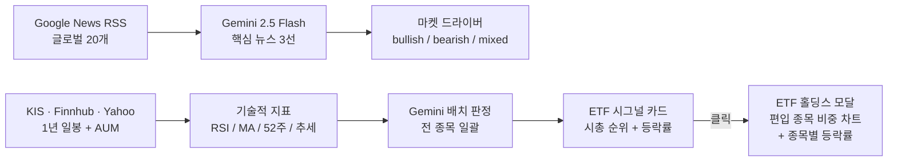
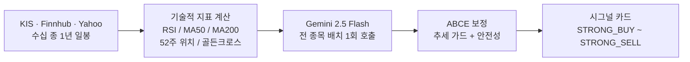
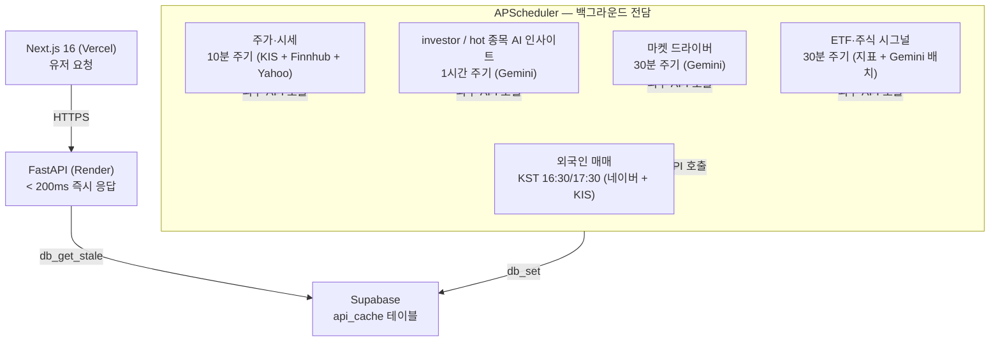
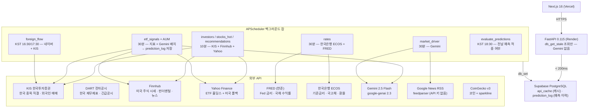

# Whalyx

[](https://www.python.org/)
[](https://nextjs.org/)
[](https://fastapi.tiangolo.com/)
[](https://ai.google.dev/)
[](https://render.com/)
[](https://vercel.com/)

[whalyx.vercel.app](https://whalyx.vercel.app) · [API Docs](https://whalyx.onrender.com/docs)

---

**AI 주식 투자 파트너 — 시장이 흔들리는 순간, 무엇을 사고 팔지 AI가 함께 읽는다.**

뉴스 하나가 시장을 바꾼다. 이란-미국 협상, Fed 발언, 반도체 규제 — 이런 변수들이 터지는 순간, 어떤 자산이 오르고 어떤 자산이 내려갈지 빠르게 판단해야 한다. 그런데 뉴스, 주식, 코인, 부동산, 자금흐름을 한곳에서 볼 수 있는 곳은 없었다.

AI가 오늘의 핵심 뉴스를 골라주고, 그에 따른 자산 변화와 매수·매도 타이밍을 한 화면에서 볼 수 있다면 투자 판단이 달라질 수 있다고 생각했다. 그래서 만들었다. 지금은 ETF·주식 매매 시그널을 중심으로, 외국인 매매·한미 금리·내 포트폴리오까지 한 화면에서 본다.

---

## 어떤 정보를 보여주는가

대시보드를 열면 가장 먼저 보이는 것은 ETF 포트폴리오 평균 수익률과 마켓 드라이버다. Gemini 2.5 Flash가 글로벌 뉴스 20개 중 오늘 시장을 가장 크게 움직이는 3개를 골라 bullish / bearish / mixed로 판단한다.

그 아래에 **미장 ETF / 국장 ETF**가 AUM(운용자산) 순위로 정렬된다. 각 ETF 카드에는 7일·1개월·6개월·1년 등락률이 한눈에 표시되고, RSI·52주 위치·추세 판정·Gemini AI 종합 시그널(STRONG_BUY ~ STRONG_SELL)이 붙는다.

ETF를 클릭하면 편입 종목이 펼쳐진다. 바 차트로 어떤 종목이 몇 % 들어있는지, 도넛 차트로 섹터 비중이 어떻게 구성되어 있는지 확인할 수 있다. 아래 테이블에서는 각 편입 종목의 현재가와 1일·7일·1개월·6개월 등락률을 볼 수 있고, 종목을 클릭하면 상세 모달로 넘어간다.


```mermaid
flowchart LR
    A["Google News RSS\n글로벌 20개"] --> B["Gemini 2.5 Flash\n핵심 뉴스 3선"]
    B --> C["마켓 드라이버\nbullish / bearish / mixed"]

    D["KIS · Finnhub · Yahoo\n1년 일봉 + AUM"] --> E["기술적 지표\nRSI / MA / 52주 / 추세"]
    E --> F["Gemini 배치 판정\n전 종목 일괄"]
    F --> G["ETF 시그널 카드\n시총 순위 + 등락률"]

    G -->|"클릭"| H["ETF 홀딩스 모달\n편입 종목 비중 차트\n+ 종목별 등락률"]
```

마켓 탭에서는 Warren Buffett, Cathie Wood, Michael Burry 등 8인의 슈퍼 투자자 포트폴리오를 추적한다. 외국인 매매 탭에서는 KOSPI·KOSDAQ 외국인 순매수·순매도 TOP 종목을, 금리 탭에서는 한국·미국 금리를 한 화면에서 확인할 수 있다.

| 투자자 | 소속 | 스타일 |
|--------|------|--------|
| Warren Buffett | Berkshire Hathaway | 가치투자 |
| Cathie Wood | ARK Invest | 혁신성장 |
| Michael Burry | Scion Asset Mgmt | 역발상 |
| Ray Dalio | Bridgewater Associates | 매크로·분산 |
| Stanley Druckenmiller | Duquesne Family Office | 기술주·매크로 |
| Bill Ackman | Pershing Square | 행동주의 |
| George Soros | Soros Fund Mgmt | 글로벌 매크로 |
| David Tepper | Appaloosa Management | 이벤트 드리븐 |

---

## ETF 시그널은 어떻게 만들어지나

ETF·주식 매수/매도 타이밍은 기술적 지표 + AI 종합 판정으로 결정된다. 스케줄러가 30분마다 미장·국장 ETF와 미국·한국 주식 수십 종의 1년 일봉 데이터를 수집한다. 한국 종목은 KIS 한국투자증권 Open API로 거래소에 직결하고, 미국 종목은 Finnhub와 Yahoo Finance에서 받는다.

수집된 종가 데이터로 5가지 기술적 지표를 계산한다 — RSI(14), 52주 고저 위치, 50/200일 이동평균, 골든크로스 여부, 1주~1년 수익률. 이 지표를 Gemini 2.5 Flash에 전 종목 일괄로 던져 STRONG_BUY / BUY / HOLD / SELL / STRONG_SELL 판정과 한 줄 근거를 받는다.


```mermaid
flowchart LR
    A["KIS · Finnhub · Yahoo\n수십 종 1년 일봉"] --> B["기술적 지표 계산\nRSI / MA50 / MA200\n52주 위치 / 골든크로스"]
    B --> C["Gemini 2.5 Flash\n전 종목 배치 1회 호출"]
    C --> D["ABCE 보정\n추세 가드 + 안전성"]
    D --> E["시그널 카드\nSTRONG_BUY ~ STRONG_SELL"]
```

AI 판정 이후 ABCE 보정이 한 단계 더 걸린다. 강세장에서 평균회귀 시그널이 너무 일찍 매도 신호를 내는 약점을 보강하기 위해, MARKUP 추세 + 안전 구간이면 매도 시그널을 한 단계 약화하고, DANGER 과열 구간이면 매수 시그널을 한 단계 강화한다.

### ETF 홀딩스 — 클릭하면 안이 보인다

ETF는 여러 종목을 하나로 묶은 상품이다. QQQ를 클릭하면 AAPL 8.9%, MSFT 8.1%, NVDA 7.5% 같은 편입 비중이 바 차트로 펼쳐진다. 섹터 도넛 차트로 Technology 51%, Communication 15% 같은 구성도 한눈에 확인된다.

그 아래 테이블에서는 편입 종목 하나하나의 현재가와 1일·7일·1개월·6개월 등락률을 볼 수 있다. "QQQ가 올랐는데 안에서 어떤 종목이 끌어올린 거지?"를 바로 확인할 수 있다. 종목을 클릭하면 상세 모달(5기간 차트·재무·애널리스트 컨센서스)로 넘어간다.

ETF 편입 종목과 섹터 비중은 Yahoo Finance topHoldings API로, 각 종목의 6개월 일봉은 chart API로 병렬 조회해 등락률을 계산한다. 24시간 DB 캐시로 반복 조회 시 즉시 응답한다.

### 시그널 판정 기준

| 시그널 | 조건 | 의미 |
|--------|------|------|
| STRONG_BUY | RSI 30 이하 + 52주 35% 이하, 또는 골든크로스 직후 | 과매도 저점, 적극 매수 구간 |
| BUY | RSI 30~45 + MA50 위 + 상승 모멘텀 | 상승 추세 초기 진입 |
| HOLD | RSI 45~65 + 추세 불분명 | 관망, 기존 포지션 유지 |
| SELL | RSI 65~75 + 52주 80% 이상 고점권 | 차익실현 고려 |
| STRONG_SELL | RSI 75 이상 + 52주 95% 이상, 또는 데드크로스 | 과매수 과열, 매도 검토 |

---

## 만들면서 부딪힌 문제들

**유저 요청마다 AI를 호출하는 구조의 한계.** 초기에는 유저가 페이지를 열 때 Gemini를 직접 호출했다. 마켓 드라이버 33초, 오늘의 투자포인트는 7분이 넘어 Render의 60초 타임아웃에 강제 종료됐다. 근본 원인은 구조였다 — 유저 요청이 곧 AI 호출이었다.

해결책은 역할 분리였다. APScheduler로 백그라운드 스케줄러를 별도로 두고, 외부 API와 Gemini 호출은 전부 스케줄러가 담당하게 했다. 엔드포인트는 Supabase에서만 읽는다. 유저 요청이 들어오는 순간 DB 조회만 하기 때문에 응답 시간이 < 200ms로 고정된다.


```mermaid
flowchart TD
    FE["Next.js 16 (Vercel)\n유저 요청"]
    BE["FastAPI (Render)\n< 200ms 즉시 응답"]
    DB["Supabase\napi_cache 테이블"]

    subgraph Scheduler["APScheduler — 백그라운드 전담"]
        J1["주가·시세\n10분 주기 (KIS + Finnhub + Yahoo)"]
        J2["investor / hot 종목 AI 인사이트\n1시간 주기 (Gemini)"]
        J3["마켓 드라이버\n30분 주기 (Gemini)"]
        J4["ETF·주식 시그널\n30분 주기 (지표 + Gemini 배치)"]
        J5["외국인 매매\nKST 16:30/17:30 (네이버 + KIS)"]
    end

    FE -->|HTTPS| BE
    BE -->|db_get_stale| DB
    Scheduler -->|db_set| DB
    J1 & J2 & J3 & J4 & J5 -.->|외부 API 호출| Scheduler
```

Gemini는 오직 스케줄러에서만 호출된다. 엔드포인트와 서버 재시작(warm_all_caches)에서는 Gemini를 부르지 않는다. redeploy가 잦아도 레이트 리밋이 걸리지 않는다.

**Yahoo 한 곳에 의존하던 리스크.** 미국 주가·금리·펀더멘털을 전부 Yahoo Finance 비공식 엔드포인트에서 끌어오다 보니, Yahoo가 응답 포맷을 바꾸거나 한국 IP를 막으면 화면 전체가 흔들렸다. 미국 주식 시세·펀더멘털·뉴스·애널리스트 컨센서스는 Finnhub 공식 API로, Fed 금리·국채 수익률은 FRED(세인트루이스 연준) 공식 데이터로 옮겼다. Yahoo는 ETF 편입 종목 조회처럼 공식 대체재가 마땅찮은 곳에만 남겼다. 한 소스가 막혀도 화면이 통째로 비지 않는다.

**속도 문제.** 주식 종목 수십 개를 순차적으로 조회하면 초당 0.5초씩 쌓여 체감 로딩이 수십 초에 달했다. Yahoo Finance는 한국 IP에서 직접 호출하면 429 에러를 반환하기도 했다. `ThreadPoolExecutor` 12개로 병렬화하고 REST 폴백을 추가하는 것으로 해결했다. 초기 로딩이 80% 단축됐다.

**외부 API 레이트 리밋.** Gemini 무료 티어는 분당 10 RPM 제한이 있다. 스케줄러에서 투자자 8명·핫 종목 12개를 순차 처리할 때 각 호출 사이에 4초 간격을 두었다. 20회 호출이 80초에 걸쳐 분산되어 분당 최대 15회를 넘지 않는다. 429 발생 시에는 에러 메시지에서 `retry in Xs`를 파싱해 자동으로 대기 후 최대 3회 재시도한다.

**한국 금융 데이터 부재.** 외국 서비스들은 Fed 금리와 미국 종목만 다루지, 한국은행 기준금리·국고채·한국 기업 재무제표를 실시간으로 제공하는 곳이 없었다. 금리·국고채·CD금리·원달러 환율은 한국은행 ECOS API로, 한국 기업의 ROE·부채비율·매출성장과 유상증자·전환사채 같은 긴급 공시는 DART(금융감독원 전자공시) API로 직접 연동했다.

---

## 시스템 구조

백엔드는 FastAPI, 프론트는 Next.js. Render(BE)와 Vercel(FE)에 배포된다. v1.5부터 DB-Only 아키텍처로 전환했다 — 엔드포인트는 Supabase만 읽고, 외부 API·AI 호출은 APScheduler 백그라운드 잡이 전담한다.


```mermaid
flowchart TD
    FE["Next.js 16 (Vercel)"]
    BE["FastAPI 0.115 (Render)\ndb_get_stale 조회만 — Gemini 없음"]
    DB["Supabase PostgreSQL\napi_cache (캐시) · prediction_log (예측 이력)"]

    subgraph Scheduler["APScheduler 백그라운드 잡"]
        S1["investors / stocks_hot / recommendations\n10분 — KIS + Finnhub + Yahoo"]
        S2["etf_signals + AUM\n30분 — 지표 + Gemini 배치\n→ prediction_log 저장"]
        S3["market_driver\n30분 — Gemini"]
        S4["rates\n30분 — 한국은행 ECOS + FRED"]
        S5["foreign_flow\nKST 16:30/17:30 — 네이버 + KIS"]
        S6["evaluate_predictions\nKST 18:30 — 전날 예측 적중 여부"]
    end

    subgraph External["외부 API"]
        KIS["KIS 한국투자증권\n한국 종목 직결 · 외국인 매매"]
        DART["DART 전자공시\n한국 재무제표 · 긴급공시"]
        FH["Finnhub\n미국 주식 시세 · 펀더멘털 · 뉴스"]
        YF["Yahoo Finance\nETF 홀딩스 + 미국 폴백"]
        FRED["FRED (연준)\nFed 금리 · 국채 수익률"]
        BOK["한국은행 ECOS\n기준금리 · 국고채 · 환율"]
        GEM["Gemini 2.5 Flash\ngoogle-genai 2.3"]
        RSS["Google News RSS\nfeedparser (API 키 없음)"]
        CG["CoinGecko v3\n코인 + sparkline"]
    end

    FE -->|HTTPS| BE
    BE -->|< 200ms| DB
    Scheduler -->|db_set| DB
    S1 --> KIS & FH & YF
    S2 --> KIS & FH & YF & GEM
    S3 --> RSS & GEM
    S4 --> BOK & FRED
    S5 --> KIS
```

```
GET  /etf-signals             # ETF·주식 STRONG_BUY/BUY/HOLD/SELL/STRONG_SELL + AUM
GET  /etf-holdings/{ticker}   # ETF 편입 종목 비중 + 섹터 + 종목별 등락률 (24h 캐시)
GET  /foreign-flow            # KOSPI/KOSDAQ 외국인 매매 (시장 합계 + TOP 종목)
GET  /foreign-flow/{ticker}   # 종목별 외국인·기관·개인 30영업일 추이 (KIS)
GET  /rates                   # 한국·미국 통합 금리 (한국은행 ECOS + FRED)
GET  /market-driver           # 오늘 시장 핵심 뉴스 3선 (Gemini)
GET  /investors               # 슈퍼 투자자 8인 포트폴리오 (13F)
GET  /stocks/recommendations  # 슈퍼 투자자 복수 매수/매도 집계
GET  /stocks/hot              # 핫 종목 TOP 12
GET  /stocks/{ticker}         # 종목 상세 + 차트 + 펀더멘털
GET  /money-flow              # 자산군 30일 수익률 + 금리 환경
GET  /crypto                  # 코인 시세 + 7일 sparkline
GET  /realestate              # 한국 부동산 지표
GET  /commodities             # 원자재 시세
GET  /mylab/portfolio         # 내 포트폴리오 실시간 평가 (인증)
POST /admin/refresh-etf-signals   # ETF 시그널 캐시 즉시 갱신
```

---

## 기술 스택

| 영역 | 기술 | 선택 이유 |
|------|------|-----------|
| Backend | FastAPI 0.115 + Python 3.11 | async 지원, 자동 OpenAPI 문서 |
| Frontend | Next.js 16 + TypeScript + Tailwind v4 | App Router, 정적 최적화 |
| AI | Gemini 2.5 Flash (google-genai 2.3) | 한국어 자연스러움, JSON mode, thinking_budget=0으로 응답 잘림 차단 |
| 한국 주가 | KIS 한국투자증권 Open API | 거래소 직결, Yahoo 대비 ~20분 신선 (시세·외국인 매매) |
| 한국 재무·공시 | DART 전자공시 (금융감독원) | ROE·부채비율·매출성장 공식 재무 + 유상증자·전환사채 긴급 공시 |
| 미국 주가·펀더멘털 | Finnhub | 공식 API로 시세·펀더멘털·뉴스·애널리스트 (Yahoo 의존 감소) |
| 미국 금리·국채 | FRED (세인트루이스 연준) | Fed Funds·국채 수익률(3M~30Y) 공식 데이터 |
| 한국 금리·환율 | 한국은행 ECOS | 기준금리·국고채·CD금리·원달러 환율 |
| ETF 편입 종목 | Yahoo Finance (topHoldings / chart) | 편입 비중·섹터·종목별 등락률 |
| 코인 | CoinGecko API v3 | 무료, sparkline 지원 |
| 뉴스 | Google News RSS + feedparser | API 키 없이 실시간 헤드라인 |
| DB | Supabase PostgreSQL (service_role) | api_cache 단일 테이블 (JSONB) |
| 차트 | Recharts | React 네이티브, 커스텀 가능 |
| 배포 | Render (BE) + Vercel (FE) | 무료 티어 프로덕션 지원 |

---

## 로컬 실행

```bash
cp backend/.env.example backend/.env
# GEMINI_API_KEY, FINNHUB_API_KEY, FRED_API_KEY, DART_API_KEY,
# BOK_API_KEY, KIS_APP_KEY, KIS_APP_SECRET, SUPABASE_URL, SUPABASE_KEY 입력

pip install -r backend/requirements.txt
python -m uvicorn backend.api.main:app --reload --port 8000

cd frontend && npm install
NEXT_PUBLIC_API_URL=http://localhost:8000 npm run dev
```

---

## 버전 히스토리

버전 번호는 SemVer(`vMAJOR.MINOR.PATCH`)를 따른다. 일반 기능 추가는 **PATCH**, 큰 기능 추가나 방향 전환은 **MINOR**, 전체 개편 수준이면 **MAJOR**를 올린다. 한 커밋이 곧 MINOR 한 칸이 아니다 — 대부분의 작업은 PATCH로 누적된다.

| 버전 | 날짜 | 내용 |
|------|------|------|
| v1.20.2 | 2026-07-21 | docs — 버전 히스토리 한 줄 요약 정리 |
| v1.20.1 | 2026-06-19 | fix — ETF 신규상장 상세/해설 결함 수정: AI 한줄 해설 버킷별 분배 + 상세 캐시 미스 시 라이브 빌드 |
| v1.20 | 2026-06-19 | feat — ETF 신규상장 탭 추가(국내·미국): 상장 예정·최근 상장 카드 + 구성종목·Gemini 해설 모달 |
| v1.19.1 | 2026-05-29 | refactor — 마켓 섹션을 좌측 세로 네비 + 우측 콘텐츠 분할 레이아웃으로 재구성 |
| v1.19 | 2026-05-29 | feat — 2단계 13F 자동 수집 파이프라인: 13f.info 크롤링으로 투자자 보유 종목 동적 최신화 |
| v1.18.6 | 2026-05-29 | feat — 투자자 포트폴리오 상위/전체 종목 수 명시 + 동향(13F 전분기 대비 증감) 의미 설명 |
| v1.18.5 | 2026-05-29 | feat — 최다 보유 종목 컨센서스 신설 + 분기 기준(2026 Q1) 배지 + 보유자 증감 표기 |
| v1.18.4 | 2026-05-29 | feat — 투자자 8인 포트폴리오를 최신 13F(2026 Q1) 기준으로 큐레이션 갱신 |
| v1.18.3 | 2026-05-29 | fix — 컨센서스 종목 확대 + 종목별 보유자 명세 + 로고 소스 교체 |
| v1.18.2 | 2026-05-29 | fix — 투자자 우측 패널에 보유 포트폴리오 인라인 표시 + 기업·투자사 로고 |
| v1.18.1 | 2026-05-29 | fix — 투자자 메인을 좌측 네비 + 우측 콘텐츠 좌우 배치로 재구성 |
| v1.18 | 2026-05-29 | feat — 메인 랜딩을 대형 투자자 포트폴리오로 전환, ETF·주식 시그널은 마켓 서브탭으로 이동 |
| v1.17.1 | 2026-05-29 | fix — 외국인 매매동향 슬립 누락일 자동 회수(콜드스타트 시 백필 판정) |
| v1.17 | 2026-05-28 | feat — Finnhub·FRED API 통합 + AI 주식 투자 인텔리전스 리브랜딩 + README 전면 개편 |
| v1.16.4 | 2026-05-28 | feat — My Lab 리밸런싱 적용 뷰 신규: 6번모드 분석 JSON 연동(테마 바·액션 오버레이·도넛) |
| v1.16.3 | 2026-05-28 | feat — 장 상태 표시기에 한국 프리마켓 구분 + 마감/다음 개장 시각 동시 표시 |
| v1.16.2 | 2026-05-28 | feat — 헤더를 한국·미국 실시간 장 상태 표시기로 전환(서머타임 자동 반영) |
| v1.16.1 | 2026-05-28 | feat — 장 운영 시간 도움말 팝오버 추가(한국·미국 장 시간표 + 용어 설명) |
| v1.16 | 2026-05-28 | feat — 금리 탭 신규(미국 Fed·한국 BOK 통합) + ETF/주식 종목 대량 추가 + 다크모드 기본값 수정 |
| v1.15.5 | 2026-05-28 | feat — 마켓 UI 리디자인 + My Lab 스냅샷 히스토리 뷰어 + 외국인 매매 레이아웃 개편 |
| v1.15.4 | 2026-05-27 | feat — ETF 대규모 확장: 한국 20종 + 미국 11종 추가(총 48종) |
| v1.15.3 | 2026-05-27 | feat — 외국인 매매 UI v2 리디자인 + 기본 다크모드 전환 + ETF 전체 편입종목 외부 링크 |
| v1.15.2 | 2026-05-27 | fix — ETF 편입종목 조회 안정화: Yahoo crumb 인증 1차 + yfinance 2차 폴백 |
| v1.15.1 | 2026-05-27 | feat — ETF·주식 UI 전면 리디자인: Premium Ink 디자인 시스템 v2(사이드바 + 테이블 레이아웃) |
| v1.15 | 2026-05-27 | feat — ETF 중심 메인 전면 개편 + Signal 탭 제거 + ETF 홀딩스 모달 신규 |
| v1.14.1 | 2026-05-26 | fix — 외국인 매매동향 CronTrigger misfire_grace_time 추가(슬립 후 잡 스킵 해결) |
| v1.14 | 2026-05-26 | feat — My Lab 실시간 포트폴리오 대시보드 신규: stock78 레포 연동 + 현재가 기반 손익 계산 |
| v1.13 | 2026-05-23 | feat — AI 추천 회고·자기학습 루프 신규: 빗나간 추천만 심층 분석 + 회피 규칙 자동 주입 |
| v1.12.2 | 2026-05-22 | feat — ETF 신호 예측 이력 저장 + 적중률 평가 시스템 추가(prediction_log) |
| v1.12.1 | 2026-05-20 | docs — README 본문 최신화: 구 퀀트 섹션 제거 + 시스템 구조·기술 스택 재작성 |
| v1.12 | 2026-05-20 | feat — 데일리 시그널 도입 + 퀀트 자동매매 전체 제거 + 한국 종목 KIS API 직결 |
| v1.11.2 | 2026-05-16 | feat — 외국인 매매 v3: 전용 탭 분리 + 과거 날짜 조회(일별 누적) |
| v1.11.1 | 2026-05-16 | feat — 외국인 매매 v2: KOSPI/KOSDAQ 시장 합계 데이터 + 프론트 UI 신규 |
| v1.11 | 2026-05-15 | feat — 외국인 매매 데이터 신규: 네이버 + 한투 KIS 결합, 순매수·순매도 TOP 엔드포인트 |
| v1.10.4 | 2026-05-09 | ci — GitHub Actions cron keep-alive로 Render cold start 방지 |
| v1.10.3 | 2026-05-09 | perf — 코드 스플리팅 + Service Worker 캐시 + 이미지 lazy loading |
| v1.10.2 | 2026-05-09 | perf — ETF·주식 prefetch + preconnect로 초기 로딩 속도 개선 |
| v1.10.1 | 2026-05-08 | feat — Hero 시간 필터별 수익률 동기화 + ETF 가격 원화 메인 표기 + i18n 2차 확장 |
| v1.10 | 2026-05-08 | feat — KO/EN 언어 토글 1차 + 핵심 라벨 영어화 |
| v1.9.4 | 2026-05-08 | feat — ABCE 시그널 정확도 보정(추세 가드·안전성 등급) + ETF 카드 심플화 |
| v1.9.3 | 2026-05-08 | fix — admin 엔드포인트 ADMIN_TOKEN ENV 옵셔널화 + 60초 쿨다운 폴백 |
| v1.9.2 | 2026-05-08 | feat — Autopilot 풍 라이트 리모델링 + ETF 매핑 4종 정정 + 즉시 갱신 엔드포인트 |
| v1.9.1 | 2026-05-08 | feat — ETF 풀 7종 확장(총 41종) + ETF별 전략 설명 카드 표시 |
| v1.9 | 2026-05-08 | feat — ETF·주식 매수매도 타이밍 시그널 신규: 기술 지표 + Gemini 종합 판정 34종 |
| v1.8.9 | 2026-05-04 | fix — 매수 시그널 인프라 정상화: 정적 JSON 폴백 + 워치리스트 자동 보강 + 진단 엔드포인트 |
| v1.8.8 | 2026-05-04 | feat — 종목 풀 1500종목 확장 + market_scanner Redis 폴백 |
| v1.8.7 | 2026-04-30 | feat — 모든 페이지 상단 progress bar 일관 적용 |
| v1.8.6 | 2026-04-30 | fix — 장 외 스캔이 장중 scan_log 결과를 덮어쓰던 버그 수정 |
| v1.8.5 | 2026-04-30 | feat — 대시보드 Quant 탭 로딩 스켈레톤 통일 |
| v1.8.4 | 2026-04-30 | feat — 리서치 저널·종목 상세 페이지 로딩 스켈레톤 추가 |
| v1.8.3 | 2026-04-30 | feat — 매매 근거 로그 가시화(scan-logs) + Cold Start UX 개선 |
| v1.8.2 | 2026-04-30 | fix — 베어장 매수 차단 버그 수정 + 퀀트 파라미터 장기 표준 완화 |
| v1.8.1 | 2026-04-29 | feat — Regime Filter 국면별 동적 파라미터 + DART 공시 긴급차단 + 워치리스트 편집 UI |
| v1.8 | 2026-04-28 | feat — Whalyx Quant 전환: 퀀트 리서치 저널 + KIS 자동매매(이후 v1.12에서 매매 제거) |
| v1.7 | 2026-04-20 | feat — 텔레그램 봇 연동: 하루 3회 글로벌 뉴스 5선 자동 발송 |
| v1.6.1 | 2026-04-13 | fix — news_ai 안정화: Gemini 실패 시 뉴스 보존 + 날짜 정합 + 프롬프트 경량화 |
| v1.6 | 2026-04-13 | feat — 메인 페이지 재설계: 한국 언론 RSS 헤드라인 + 카테고리별 급등·급락 탭 |
| v1.5.3 | 2026-04-13 | fix — DB-Only 안정화 2차: 분석 오류 DB 저장 방지 + 한국어 뉴스 우선 폴백 |
| v1.5.2 | 2026-04-10 | feat — 오늘의 투자포인트 뉴스 기반 전환(FinBERT 제거) + 한국 경제뉴스 카테고리 추가 |
| v1.5.1 | 2026-04-10 | fix — DB-Only 안정화: Gemini 503 재시도 + 스케줄러 버그 수정 + 첫 배포 빈 화면 방지 |
| v1.5 | 2026-04-09 | feat — DB-Only 아키텍처 전환: APScheduler 사전 갱신 + 유저 요청은 Supabase만 읽어 즉시 응답 |
| v1.4 | 2026-04-08 | feat — Google News RSS 전환 + 마켓 드라이버 3선 + Railway→Render 이전 + Supabase DB 캐시 |
| v1.3 | 2026-04-07 | feat — 주식 상세 모달 전면 개편: 5기간 차트 + 전체 펀더멘털·컨센서스 |
| v1.2.2 | 2026-04-07 | feat — 투자포인트 종목 카드 KRW 원화 표시 + CoinGecko 429 재시도 개선 |
| v1.2.1 | 2026-04-07 | fix — CoinGecko UA·재시도·TTL 개선 + Yahoo Finance workers 제한 |
| v1.2 | 2026-04-07 | feat — 오늘의 투자포인트 페이지 추가: S&P 500 AI 분석, 메인 교체 |
| v1.1 | 2026-03-26 | feat — recharts 반원 게이지 + 다크/라이트 모드 + Fed 금리 실시간 연동 + 모바일 반응형 |
| v1.0 | 2026-03-24 | feat — 최초 배포: 투자자 포트폴리오 추적 + 핫 종목 + AI 거시분석 대시보드 |
